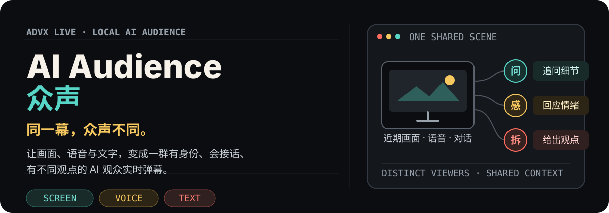
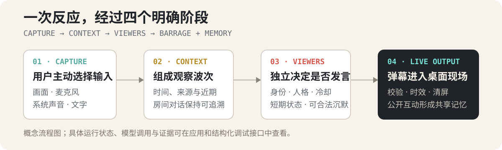

<p align="center">
  
</p>

<p align="center">
  <strong>Electron + React</strong> · <strong>FastAPI</strong> · <strong>OpenAI-compatible Multimodal</strong> · <strong>StepFun ASR</strong>
</p>

AI Audience（众声）是一套面向创作者的本地 AI 虚拟观众席。它持续理解你主动选择的画面、主播语音、系统声音与文字消息，再让一群拥有不同身份、性格和近期状态的 AI 观众通过实时弹幕参与现场。

它不向公网推流，不接入真人账号，也不制造虚假流量。它解决的是开播前与零观众阶段最直接的问题：当暂时没有人回应时，创作者仍然可以练习表达、测试节奏，并从不同观众视角获得即时反馈。

## 你会得到什么

- **与现场相关的回应**：弹幕基于近期画面、语音转写、文字消息和公开房间对话，而不是随机套话。
- **真正不同的观众**：每位 Viewer 都有独立身份、人格、冷却和短期状态；面对同一幕，可以关注不同细节，也可以保持沉默。
- **可以继续的关系**：点名某位观众、回应上一条弹幕或延续近期话题时，系统会保留本场直播中的身份与对话连续性。
- **可选择的房间气氛**：内置多种场景模式与人格模板，也支持模式内覆盖、自定义模式和成长梗库。
- **不挡操作的弹幕**：回应可以显示在桌面覆盖层或独立互动窗口中，并提供暂停、清屏、隐藏、禁言和移出等控制。
- **看得见的运行状态**：采集、ASR、模型调用、观众状态和结构化 trace 都有明确的调试入口。

## 一次现场如何形成

<p align="center">
  
</p>

1. 你选择要分享的屏幕、窗口或应用，并选择麦克风；Windows 还可以开启系统声音。
2. 应用把有效画面、带来源的语音转写、文字消息和近期对话组成可追溯的观察上下文。
3. 活跃观众根据各自人格、状态、冷却和现场压力独立决定是否发言。
4. 通过身份、结构、时效和重复检查的候选进入桌面弹幕；公开互动可以继续沉淀为本地共享记忆。

## 为什么它不只是“随机弹幕生成器”

### 同一现场，多种观察

观众共享同一个直播间上下文，但不会共享同一套观点。有人追问细节，有人回应情绪，有人拆解操作，也有人选择不说话。系统保留明确的 `viewer_instance_id`，每条 AI 弹幕都能追溯到具体观众。

### 时间和证据优先

画面、语音与房间事件都带时间和来源。过期结果会被丢弃，模型输出也不能绕过本地校验直接显示。调试 API、结构化 trace、headless harness 与确定性 replay 用来判断一条反应为何出现。

### 模式、人格与记忆分层

模式控制房间气氛与参与者组合；PersonaTemplate 定义可复用行为；ViewerInstance 只属于本次直播；公开互动进入 Room 共享记忆。编辑一个模式不会意外改写其他模式的人格覆盖。

## 适合这些场景

- 新主播练习解说节奏、临场回应和冷场处理。
- 玩家在游戏过程中获得贴合画面的反馈与陪伴。
- 讲述者预演课程、产品演示或线上分享。
- 创作者在发布前测试内容是否清楚、是否能引发讨论。
- 独自创作时，希望屏幕另一侧不再完全安静。

## 快速开始

当前仓库面向源码开发与真实管线联调。

### 环境要求

- Node.js 24+
- pnpm 11+
- Python 3.11 或 3.12
- uv 0.11+
- 一个支持图像输入的 OpenAI-compatible 模型服务
- 需要语音互动时，准备 StepFun ASR API Key

### 启动

```bash
git clone https://github.com/woodfishhhh/ADVX-live.git
cd ADVX-live

pnpm install
uv sync --project apps/backend --group dev
pnpm contracts
pnpm dev
```

`pnpm dev` 会用同一份临时本地令牌启动 FastAPI 与 Electron。首次联调时，在桌面端“设置”中填写模型地址、模型名称、模型 API Key 与 StepFun ASR API Key，然后选择画面和麦克风并开始直播。

完整步骤见[真实管线联调](./docs/REAL_PIPELINE.md)。

## 技术架构

```text
apps/desktop        Electron + React 控制台、采集、覆盖层与本地工作区
apps/backend        FastAPI 应用层、观众运行时、Provider 与结构化调试
packages/contracts  由 Pydantic / OpenAPI 生成的 TypeScript 合同
resources           内置观众模式、PersonaTemplate 与分发资源
tests               跨应用端到端场景、录制回放与合成夹具
docs                产品、架构、运行协议与决策文档
```

核心技术：

- Electron、React、TypeScript、Tailwind CSS 与 Zustand 构建桌面端。
- FastAPI、Python、SQLAlchemy 与 SQLite 构建本地后端。
- WebSocket 与二进制协议承载实时状态、采集数据和弹幕事件。
- OpenAI-compatible API 接入用户选择的多模态模型。
- Pydantic、OpenAPI 与生成的 TypeScript 类型维护跨进程合同。

## 开发与验证

```bash
pnpm typecheck
pnpm test
pnpm build
uv run --project apps/backend ruff check apps/backend
```

常用专项入口：

```bash
pnpm test:e2e:viewer-runtime
pnpm evidence:viewer-runtime
pnpm smoke:desktop-runtime
```

## 隐私与产品边界

- 这是本地虚拟直播体验，不向公网推流，也不创建真人可以加入的公开房间。
- 所有虚拟观众都明确标识为 AI，不包装成真人用户或真实流量。
- 只有你主动选择的屏幕、语音转写、文字和必要房间上下文会发送给已启用的服务。
- 原始音频与连续屏幕帧默认不持久保存；模型与 ASR 凭据通过 Electron `safeStorage` 保存。
- 用户配置、观众记忆、日志和本地工作区不会写入仓库。
- 网络、模型或 ASR 失败时，暂停、清屏和停止等本地控制仍应可用。

## 深入阅读

- [产品说明](./docs/PRODUCT.md)
- [系统架构](./docs/ARCHITECTURE.md)
- [AI 观众发言产品规格](./docs/AUDIENCE_SPEAKING_PRODUCT_SPEC.md)
- [后端详细设计](./docs/BACKEND_DESIGN.md)
- [真实管线联调](./docs/REAL_PIPELINE.md)
- [Viewer Runtime 集成计划](./docs/VIEWER_RUNTIME_INTEGRATION_PLAN.md)
- [决策与开放问题](./docs/DECISIONS.md)
