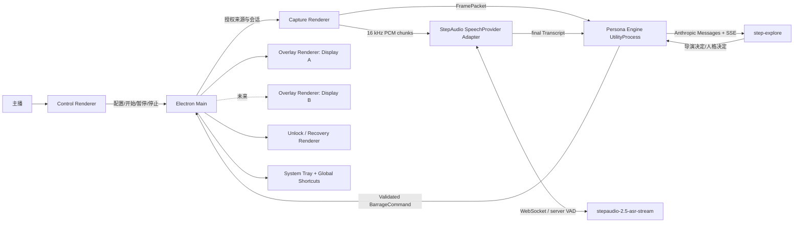
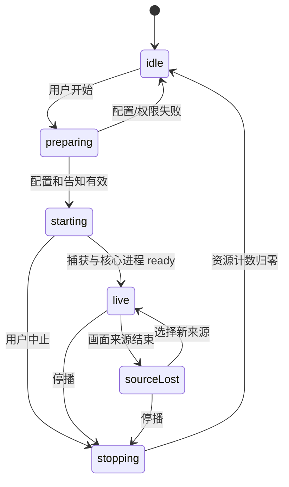

# FakeLive 从零架构设计

> 状态：Greenfield 基线草案  
> 适用范围：Windows 黑客松原型，以及在不推翻核心边界的前提下演进到正式产品  
> 权威性：本文描述新的云端 `step-explore`、独立人格和全屏弹幕架构。旧 `docs/ARCHITECTURE.md` 中“本地 VLM、单模型事件流水线、竖向评论窗”等内容不再是本方向的实现基线。

## 1. 架构目标

FakeLive 的系统目标不是“在桌面上随机放几条字”，而是稳定闭合下面这条实时链路：

```text
用户选择画面与麦克风
  -> 应用持续形成最近 10/20 秒的多模态观察
  -> 32 个稳定身份的人格按调度独立思考
  -> 人群导演只调节强度，不代写人格弹幕
  -> 过期、重复或不安全的候选被丢弃
  -> 合法弹幕在透明、置顶、可点击穿透的覆盖层中从右向左飞过
```

架构必须同时满足：

- **桌面可靠性**：模型、ASR 或某个人格失败不能冻结控制窗和弹幕渲染。
- **实时性优先**：旧观察宁可丢弃，也不能在十几秒后补播“过期惊讶”。
- **人格隔离**：每个 AI 观众有独立身份、短期历史和请求流，不能串号。
- **云端边界清楚**：截图和转写会发送给 `step-explore`；加密持久化和解密权只在 Main，明文 Key 只短暂存在于一次性 KeyEntry、Main 和受信任 Persona Engine，绝不进入其他 Renderer。
- **停止必须彻底**：停播不是隐藏 UI，而是停止媒体轨道、取消 SSE、清空队列并让旧会话失效。
- **先证明再扩张**：黑客松可以只支持一个明确选择的显示器，但进程和消息契约不能阻碍未来每屏一个 Overlay。

## 2. 总体拓扑



### 2.1 进程部署图

| 边界 | 运行位置 | 持有的敏感能力 | 不允许做的事 |
| --- | --- | --- | --- |
| Electron Main | Electron 主进程 | 会话权威、窗口、全局快捷键、托盘、`safeStorage` 中的开发者 StepFun Key、子进程生命周期 | 不处理帧、不跑 ASR、不解析 32 路模型正文 |
| Control Renderer | 沙箱 Renderer | 用户可见配置与状态 | 不拿 API Key，不直接访问 Node，不直接启动媒体流 |
| KeyEntry Renderer | 一次性隔离沙箱 Renderer | 用户当前输入的 Key，直到单次提交完成 | 不读已保存 Key、不导航、不联网、不开 DevTools、不承载其他业务 |
| Capture Renderer | 隐藏或最小化沙箱 Renderer | 经授权的屏幕与麦克风 `MediaStream` | 不做语义判断，不持久化原始媒体 |
| Persona Engine | Electron `utilityProcess` | 观察窗口、人格状态、导演、调度、SSE、限流、TTL | 不创建窗口，不直接操作系统设备，不把原始媒体写盘 |
| StepAudio SpeechProvider Adapter | 独立 Electron `utilityProcess`，使用 Node `ws` | PCM 分块、限定到 StepAudio origin 的 StepFun Key、转写与取消 | 不访问截图、人格 Prompt、Overlay 或任意文件 |
| Overlay Renderer | 每个目标显示器一个沙箱 Renderer | 已验证的弹幕命令 | 不访问截图、麦克风、人格 Prompt、API Key |
| Unlock Renderer | 独立小窗 | 恢复点击、暂停、清屏、停播的最小命令 | 不承载业务配置，不依赖 Overlay 自身可点击 |

## 3. 进程职责

### 3.1 Electron Main：会话与权限的唯一权威

主进程负责：

- 创建、定位、显示和销毁 Control、KeyEntry、Capture、Overlay、Unlock 窗口。
- 维护单实例、托盘菜单、固定的全局恢复快捷键。
- 枚举显示器、窗口、麦克风和扬声器，并把用户选择固化为 `LiveConfig`。
- 生成单调递增的 `sessionGeneration` 与唯一 `sessionId`。
- 从本机安全存储解密开发者填写的 StepFun Key，通过两个私有注入通道分别交给 Step-explore Client 与 StepAudio Adapter；两个 Adapter 只能访问各自固定的 `api.stepfun.com` 路径。当前没有已知短期令牌能力，因此不能把同一 Key 描述成 capability token。
- 启动、健康检查、终止 Persona Engine 与当前 SpeechProvider Adapter。
- 校验所有跨进程消息的来源、结构、大小、时间戳和会话代数。
- 将通过验证的 `BarrageCommand` 路由到正确的每屏 Overlay。
- 处理暂停、清屏、隐藏、紧急解锁、停播等必须可恢复的命令。

主进程不得：

- 编码 Base64 图片、做 VAD、跑 ASR 或解析长 SSE。
- 维护人格 Prompt、人格历史或弹幕轨道。
- 暴露通用 `ipcRenderer.send(channel, payload)` 给 Renderer。

### 3.1.1 KeyEntry 一次性输入边界

- Control 只能请求 Main 打开 KeyEntry，不能取得输入结果或已保存密钥。
- KeyEntry 使用独立 preload，只暴露 `submitOnce(value)` 与 `cancel()`；提交事件只允许来自该窗口和一次性 nonce。
- KeyEntry 禁用 DevTools、导航、远程内容、日志正文和网络；提交后清空字段并立即销毁。
- Main 收到后直接测试/加密保存，不通过公共事件总线广播。测试失败也只返回脱敏状态。
- 该窗口内明文短暂存在是明确例外；其余 Renderer 和任何可长期打开的 DevTools 都不得接触 Key。

### 3.2 Control Renderer：控制台而不是后台服务

Control 只负责显示和采集用户意图：

- 画面来源与目标显示器是两个独立字段。
- 麦克风选择、实时音量测试；扬声器选择与测试音。
- 主播名称、背景、正在玩的游戏或话题。
- 人格包、启用人格、基础热闹度、爆点上限和冷场策略。
- 最近观察窗口、弹幕样式、显示区域与保护区。
- 连接、捕获、ASR、模型、429 限流和人格健康状态。
- 开始、暂停、恢复、清屏、隐藏、解锁和停止。

Control 通过 preload 暴露的窄接口读写状态。它崩溃后可由 Main 重建，不应导致正在运行的会话继续失控。

### 3.3 Capture Renderer：浏览器媒体能力的隔离层

Capture 持有用户批准的媒体轨道：

- `getDisplayMedia` 或 Electron 授权的桌面来源产生视频轨道。
- `getUserMedia` 按选定 `deviceId` 产生麦克风轨道。
- `AudioWorklet` 执行单声道转换、重采样、音量计和有界 PCM 分块。
- Web Worker / OffscreenCanvas 执行缩放、图片编码和可选的变化检测。
- 每秒形成约一个代表帧；10/20 秒指观察时间窗，不等于必须把全部帧发送给每个请求。
- 使用 `MessagePort` 和可转移 `ArrayBuffer` 将帧/PCM 交给 Persona Engine，避免 Main 中转大对象。

Capture 的输出是短生命周期引用。收到暂停、停播、来源结束或代数变化时，必须立刻：

1. 停止所有媒体轨道。
2. 关闭 Worklet/Worker 和 MessagePort。
3. 释放环形缓冲中的 Blob、Bitmap 与 ArrayBuffer 引用。
4. 发出终止确认，而不是仅隐藏窗口。

### 3.4 Persona Engine UtilityProcess：AI 编排核心

Persona Engine 负责：

- 维护有界的最近帧与带时间戳转写窗口。
- 形成不可变的 `ObservationSnapshot`。
- 维护约 32 个会话内稳定人格的独立短期状态。
- 运行人群导演这个独立逻辑会话。
- 选择本轮激活人格，控制基础和爆点并发。
- 为每个人格构造独立 Anthropic Messages 请求。
- 解析 SSE、处理超时、取消和全局 429 背压。
- 校验模型结构化输出，执行硬内容策略、去重与 TTL。
- 将候选交给密度控制器，输出最终 `BarrageCommand`。
- 在直播会话期间短暂持有调用所需 Key，只用于固定 Step-explore 路径的请求头；StepAudio Adapter 单独持有同一 Key 的会话副本并限制到 ASR 路径。停播时两处都释放引用并重启/终止相关进程以清空状态。
- 产出脱敏的指标和状态，不记录原始截图、录音、完整 Prompt 或 API Key；默认不收集 Persona Engine 内存崩溃转储。

这个进程可以崩溃并由 Main 结束会话或有界重启；它不能拥有窗口控制权。

### 3.5 StepAudio SpeechProvider：实时云端转写

首版选用 StepFun StepAudio 2.5，同时固定 `SpeechProvider` 以保留协议适配和未来本地回退能力：

- P0 主路径连接 `wss://api.stepfun.com/v1/realtime/asr/stream`，模型为 `stepaudio-2.5-asr-stream`。
- Capture 发送有界 PCM 分块；初始 wire 配置按官方示例试用 `pcm_s16le`、16 kHz、16 bit、单声道，但 `append.audio` 的格式歧义必须由 Gate 0 真机探针关闭。
- 默认配置 `server_vad`，由 `speech_started` / `speech_stopped` 划分语句；本地不加载 VAD ONNX 模型。
- `delta.text` 是可能改写前文的累计文本，只用于诊断或临时字幕并整体替换；只有 `completed.transcript` 进入 `TranscriptRing`。
- 输出 `Transcript` 包含本地单调时钟映射后的开始/结束时间、最终文本和可用的字级时间戳。
- 识别慢于 TTL 的结果直接丢弃。
- Adapter 不得获得屏幕帧或人格上下文，只允许访问已同意的 StepAudio WebSocket origin。

`POST /v1/audio/asr/sse` + `stepaudio-2.5-asr` 仅作为“一次提交一段音频”的探针/回退候选，不等同于实时双向流。若未来采用本地实现，则放入独立 UtilityProcess/Sidecar，并继续暴露同一 `SpeechProvider` 会话合同，不能让部署形态泄漏到 Persona Engine。

如果手环在 Windows 中表现为标准麦克风，它复用同一 Capture 路径；只有协议明确需要 GATT、串口或厂商 SDK 时，才新增 `AudioSourceProvider`。

### 3.6 Crowd Director：只调度，不代写

人群导演是 Persona Engine 内的独立模型会话，不是第 33 个发言人格：

- 判断当前是 `calm`、`ordinary` 还是 `major`。
- 给出事件键、目标活跃人格数、爆发时长和截止时间。
- 可以识别 CSGO 单杀、三杀、击杀后死亡、零击杀死亡等候选事件。
- 同一事件键处于冷却期时不得重复触发完整弹幕潮。
- 导演失败时回退到基础热闹度，不能停止所有人格。
- 导演输出永远不能直接成为屏幕文字。

### 3.7 每屏 Overlay Renderer：纯渲染终端

目标架构为每个被覆盖显示器创建一个 Overlay：

- 透明、无边框、置顶、不出现在任务栏。
- 直播时通过 Electron 原生能力点击穿透。
- 只接收已经过验证、带 TTL 的 `BarrageCommand`。
- 负责轨道分配、像素测量、RTL 动画、顶/底固定、保护区和 resize。
- 暂停冻结当前动画；清屏销毁当前与排队弹幕；隐藏不积压补播。
- 无模型或网络时 Overlay 仍可响应控制命令并完成已有动画。

黑客松允许只实现“一个明确选择的目标显示器”，但协议必须包含 `targetDisplayId`，不能把主屏坐标写死。

### 3.8 Unlock / Recovery：不能依赖覆盖层自救

点击穿透一旦配置错误，Overlay 里的按钮也可能无法点击，因此至少保留三条独立恢复路径：

- 固定全局快捷键。
- 系统托盘菜单。
- 独立 Unlock 小窗。

这三条路径均由 Main 处理，不能通过 Overlay Renderer 转发。紧急停播必须无确认框、立即执行。

## 4. 端到端数据流

### 4.1 开播

```text
Control 提交 LiveConfig
  -> Main 运行时校验 + 云上传告知状态校验
  -> Main 创建 sessionId 与递增 generation
  -> Main 启动/检查 Persona Engine
  -> Main 授权 Capture 来源
  -> Capture 获得真实 video track
  -> if microphoneDeviceId != null:
       Capture 获得 audio track -> Main 启动/检查 SpeechProvider
     else:
       不请求麦克风权限 -> transcripts 始终为空 -> 标记 visual-only
  -> Main 创建目标显示器 Overlay 与 Unlock
  -> 所有组件回报 ready
  -> Session 进入 live
```

任一必需画面轨道失败都不能进入 `live`。完整模式的麦克风或 SpeechProvider 失败时，必须由用户明确确认后重新走仅画面分支；不能在后台静默降级。仅画面模式不能算“语音陪伴验收通过”。

### 4.2 观察形成

```text
视频轨道 -> 低分辨率代表帧 -> 有界 FrameRing
麦克风轨道 -> AudioWorklet -> PCM chunks -> StepAudio WebSocket/server VAD -> final TranscriptRing
FrameRing + TranscriptRing + 最近公开弹幕摘要
  -> ObservationSnapshot
```

每个快照只包含必要引用。请求默认从完整 10/20 秒窗口中选择 2–4 个关键帧；API 探针用于确认 wire schema、尺寸和安全上限，而不是决定是否无条件发送全部秒帧。

### 4.3 人格与导演调用

```text
ObservationSnapshot
  -> DirectorLane -> CrowdDecision
  -> Scheduler 计算 targetActivePersonas
  -> Persona 01 独立请求
  -> Persona 07 独立请求
  -> Persona 23 独立请求
  -> ...
```

同一观察可以被多个独立人格复用，但每个人格的系统提示、短期历史、请求 ID 和输出验证均独立。共享图片字节应在本地以内存引用复用，不能让人格 A/B 共用一条模型会话冒充独立人格。

### 4.4 候选到屏幕

```text
PersonaDecision
  -> SchemaValidator
  -> HardSafetyPolicy
  -> Blocklist
  -> Exact/NearDuplicateFilter
  -> TTL Gate
  -> DensityController
  -> BarrageCommand
  -> Main route by targetDisplayId
  -> Overlay TrackAllocator
```

任何阶段失败均“丢弃该候选”，不把模型原文或不完整 JSON 直接显示。

### 4.5 暂停、清屏、隐藏与停播的语义

| 命令 | 捕获/麦克风 | 新 AI 请求 | 在途请求 | 屏幕与队列 |
| --- | --- | --- | --- | --- |
| 暂停直播 | 停止或暂停采集 | 禁止 | 取消 | 当前动画冻结，队列丢弃 |
| 清屏 | 继续 | 继续 | 继续 | 当前与待显示弹幕清空 |
| 隐藏 Overlay | 继续 | 继续 | 继续 | 不显示且不积压补播 |
| 恢复 | 只使用恢复后的新上下文 | 恢复 | 不复活旧请求 | 从空队列开始 |
| 停播 | 全部 `stop()` | 禁止 | 全部 abort | 清空并销毁 Overlay |

“暂停”是隐私动作，不只是暂停 CSS 动画。

## 5. 核心 TypeScript 契约

以下契约表达边界，不代表已经确定某个运行时校验库。

```ts
type SessionId = string;
type PersonaId = string;
type DisplayId = string;

interface Envelope<T> {
  schemaVersion: 1;
  sessionId: SessionId;
  sessionGeneration: number;
  sentAtMonoMs: number;
  requestId: string;
  payload: T;
}

type SilencePolicy = 'natural-silence' | 'continuous-ambient';

interface LiveConfig {
  captureSourceId: string;
  targetDisplayId: DisplayId;
  microphoneDeviceId: string | null;
  speakerDeviceId: string | null;
  streamerName: string;
  streamerBackground: string;
  frameWindowSeconds: 10 | 20;
  frameSampleHz: number;
  decisionTickHz: number;
  userMaxRequestsPerSecond: number;
  baseActivePersonas: number;
  burstActivePersonasMax: number;
  silencePolicy: SilencePolicy;
  enabledPersonaIds: PersonaId[];
  barrage: BarrageSettings;
}

interface FrameRef {
  id: string;
  capturedAtMonoMs: number;
  width: number;
  height: number;
  mimeType: string;
  byteLength: number;
  contentHash: string;
  expiresAtMonoMs: number;
}

interface FramePacket extends FrameRef {
  bytes: ArrayBuffer;
}

interface Transcript {
  id: string;
  source: 'microphone';
  startedAtMonoMs: number;
  endedAtMonoMs: number;
  text: string;
  confidence?: number;
  expiresAtMonoMs: number;
}

interface AudioSourceDescriptor {
  id: string;
  label: string;
  kind: 'microphone';
  isDefault: boolean;
}

interface AudioChunk {
  sequence: number;
  startedAtMonoMs: number;
  endedAtMonoMs: number;
  sampleRateHz: 16000;
  bitDepth: 16;
  channels: 1;
  encoding: 'pcm_s16le';
  bytes: ArrayBuffer;
}

interface ObservationSnapshot {
  id: string;
  observedAtMonoMs: number;
  frameRefs: FrameRef[];
  transcripts: Transcript[];
  recentPublicBarrage: Array<{
    personaId: PersonaId;
    text: string;
    shownAtMonoMs: number;
  }>;
  streamerBackground: string;
  silencePolicy: SilencePolicy;
  expiresAtMonoMs: number;
}
```

```ts
interface PersonaProfile {
  id: PersonaId;
  displayName: string;
  archetype: string;
  systemPrompt: string;
  speakingStyle: string[];
  triggerPreferences: string[];
  tabooTopics: string[];
  silenceBias: number;
  burstBias: number;
  repetitionBias: number;
  contentFlags: string[];
}

interface PersonaMemory {
  personaId: PersonaId;
  sessionId: SessionId;
  summary: string;
  recentTurns: Array<{ role: 'assistant' | 'user'; text: string }>;
  updatedAtMonoMs: number;
}

type PersonaDecision =
  | {
      kind: 'silent';
      reasonCode?: 'nothing-to-add' | 'persona-would-lurk' | 'duplicate';
    }
  | {
      kind: 'comments';
      comments: Array<{
        text: string;
        sequence: 0 | 1;
      }>;
      perceivedEvent?: string;
      confidence?: number;
      plusOneCandidate?: boolean;
    };

interface CrowdDecision {
  observationId: string;
  eventKey?: string;
  intensity: 'calm' | 'ordinary' | 'major';
  targetActivePersonas: number;
  burstDurationMs: number;
  expiresAtMonoMs: number;
}
```

```ts
interface BarrageSettings {
  fontSizePx: number;
  opacity: number;
  speedPxPerSecond: number;
  density: number;
  displayArea: { topRatio: number; bottomRatio: number };
  protectedRegions: Array<{
    xRatio: number;
    yRatio: number;
    widthRatio: number;
    heightRatio: number;
  }>;
}

interface BarrageCommand {
  id: string;
  targetDisplayId: DisplayId;
  personaId: PersonaId;
  text: string;
  mode: 'scroll' | 'top' | 'bottom';
  createdAtMonoMs: number;
  showAtMonoMs: number;
  expiresAtMonoMs: number;
  priority: 1 | 2 | 3;
  style: {
    color: string;
    fontSizePx: number;
    opacity: number;
    outline: boolean;
  };
  speedPxPerSecond: number;
  waveId?: string;
}

interface StepExploreClient {
  streamDecision(
    request: StepExploreRequest,
    signal: AbortSignal,
  ): AsyncIterable<StepExploreEvent>;
}

interface SpeechSession {
  write(chunk: AudioChunk): Promise<void>;
  completed(signal: AbortSignal): AsyncIterable<Transcript>;
  close(reason: 'pause' | 'stop' | 'device-change' | 'failure'): Promise<void>;
}

interface SpeechProvider {
  openSession(
    config: {
      language: 'zh';
      promptContext: string;
      enableTimestamps: boolean;
      useServerVad: true;
    },
    signal: AbortSignal,
  ): Promise<SpeechSession>;
}

interface AudioSourceProvider {
  list(): Promise<AudioSourceDescriptor[]>;
  open(
    sourceId: string,
    signal: AbortSignal,
  ): Promise<ReadableStream<AudioChunk>>;
}
```

规则：

- 所有网络模型返回都先进入 `unknown`，经过运行时校验后才可成为 `PersonaDecision`。
- 模型只返回“说什么/沉默”；代码决定并发、何时显示、轨道、速度、TTL 和取消。
- `PersonaMemory` 默认只在当前直播会话存在。长期用户记忆不属于黑客松核心。

## 6. IPC 与 MessagePort

### 6.1 控制面：小消息走类型化 IPC

| 发起方 | Main API | 结果 |
| --- | --- | --- |
| Control | `getSetupState()` | 脱敏的设备、来源、人格与连接状态 |
| Control | `startLive(config)` | `sessionId`、代数和启动结果 |
| Control/Unlock | `pauseLive()` / `resumeLive()` | 会话状态 |
| Control/Unlock/Tray | `clearBarrage()` / `unlockOverlay()` | 即时确认 |
| Control/Unlock/Tray | `stopLive()` | 停止确认与资源计数 |
| Main | `onLiveState(listener)` | 脱敏状态事件 |
| Main | `onBarrageCommand(listener)` | 只对目标 Overlay 暴露 |

每个 preload 只暴露它需要的子集。Overlay preload 不得出现 `startLive`、设备枚举或密钥相关方法。

### 6.2 数据面：帧与 PCM 走 MessagePort

- Capture 与 Persona Engine 建立专用端口。
- `ArrayBuffer` 必须进入 transfer list，发送后 Capture 不再读写。
- 每个端口绑定唯一 `sessionGeneration`，代数不符即关闭。
- 设定单包与累计在途字节上限；达到上限丢弃最旧观察，不无限排队。
- Main 只建立和转交端口，不读取数据正文。

### 6.3 运行时防线

- 校验 schema 版本、枚举、字符串长度、数组长度、时间范围和字节长度。
- 拒绝未来时间、已过 TTL、未知 `displayId` 和未知 `personaId`。
- 日志只记录 ID、状态码、耗时、字节数、drop reason；默认不记录文本正文。
- 任何 Renderer 内容都视为不可信输入。

## 7. 状态机

### 7.1 直播会话



`degraded` 不应是与 `live` 互斥的唯一状态，而应是一组健康标记，例如 `asrUnavailable`、`micDisconnected`、`directorUnavailable`、`rateLimited`。这样“仍在直播但只有视觉理解”能被准确表达。

### 7.2 单个人格

```text
idle -> queued -> streaming -> validating -> idle
             \-> backoff -> queued
             \-> quarantined
```

- 每个人格最多一个在途请求。
- 在途期间只保留“最新待处理观察”，新快照替换旧快照。
- 连续结构错误的人格进入短暂隔离，不能拖垮其他人格。

### 7.3 全局限流

```text
normal -> throttled -> openCooldown -> halfOpen -> normal
                         ^                |
                         +----失败--------+
```

- `429` 是全局信号，不允许 32 个任务各自立即重试。
- 优先遵守服务端 `Retry-After`；否则使用有上限的指数退避和抖动。
- 限流时先降低 ambient 请求，再降低普通人格数；保留控制面与取消能力。
- `halfOpen` 只放行少量探针请求，成功后逐级恢复。

### 7.4 弹幕生命周期

```text
candidate -> validated -> scheduled -> displayed
    |            |            |
    +-> dropped  +-> dropped  +-> expired/cleared
```

任何 `showAtMonoMs >= expiresAtMonoMs` 的命令不得进入 Overlay。清屏后旧命令不能因 IPC 重放再次出现。

## 8. 调度、背压和实时性

### 8.1 人格调度

- 产品有约 32 个稳定身份，不代表每秒固定发起 32 次调用。
- 系统明确区分 `frameSampleHz`（画面进入观察环）、`decisionTickHz`（多久形成一次新决策机会）和实际 HTTP requests/s；三者不能在 UI 或指标中混为一个数。
- 用户配置基础活跃人数与爆点上限；普通界面使用“热闹度”，高级界面可设置 `decisionTickHz` 和 `userMaxRequestsPerSecond` 并查看真实并发。
- 这些值是用户硬上限。GlobalRateController 还会用实测服务配额、429、队列和 TTL 得到更低的有效值；任何设置都不能强迫系统超出 Gate 0 已验证范围。
- Scheduler 综合公平性、人格触发偏好、最近发言时间、导演强度、限流状态和硬上限选择人格。
- 同一人格在短期内不连续霸屏；两句连续发言作为同一 `sequence` 调度。
- “允许沉默”时 `silent` 是成功结果，不重试。
- “持续热闹”时可以生成环境梗，但不得捏造刚发生了击杀。

### 8.2 观察背压

- 帧窗口有界为 10/20 秒；超期引用释放。
- 每个人格只保留当前在途观察和一个最新待处理观察。
- ASR 只保留尚在上下文 TTL 内的片段。
- 密度控制器有屏幕容量上限，超额时按过期、低优先级、重复度顺序丢弃。
- 大事件可以抢占尚未显示的低优先级 ambient 弹幕。

### 8.3 TTL

建议所有阶段使用单调时钟：

- 帧与转写：到达观察窗口外立即过期。
- `CrowdDecision`：只在指定爆发窗口有效。
- 普通事件反应：应在数秒级截止，具体阈值通过端到端延迟基准校准。
- 已过期的模型成功响应也算 `dropped: stale`，不能为了“利用 Token”而显示。

### 8.4 停播 generation

Main 在每次开始和停止时递增 `sessionGeneration`：

1. 广播新的停止代数。
2. 取消所有 Fetch/SSE/ASR `AbortController`。
3. 停止媒体轨道并关闭端口。
4. 清空观察、人格待办、密度队列和 Overlay。
5. 等待各进程回报活动轨道、请求和队列均为零。
6. 超时则强制终止 UtilityProcess/Sidecar。

任何旧代数的迟到消息一律丢弃。即使 `sessionId` 被错误复用，generation 仍能阻止旧弹幕串入新直播。

## 9. 故障与降级

| 故障 | 自动行为 | 用户可见状态 | 恢复 |
| --- | --- | --- | --- |
| 单人格超时/断流 | 取消该请求，保留最新观察，有限退避 | 可在高级状态看到 1 人异常 | 下一轮重新排队 |
| 人格返回非法 JSON/越界文本 | 丢弃并计数，连续失败后隔离 | 不显示原始输出 | 冷却后半开探测 |
| 导演失败 | 保持基础热闹度，不触发爆点 | “人群导演暂不可用” | 独立重试 |
| HTTP 429 | 全局降并发、暂停 ambient、进入冷却 | 显示当前活跃人格已自动降低 | 半开逐级恢复 |
| Step-explore 不可用 | 停止上传，取消网络任务；Overlay 与控制仍可用 | “AI 观众暂不可用” | 健康检查通过后由用户或策略恢复 |
| ASR 失败 | 进入仅画面模式 | 明确标注未听见主播 | Provider 重连/重新选择 |
| 麦克风断开 | 停止对应轨道，不把其他音频冒充主播 | “麦克风已断开” | 用户选择新设备 |
| 画面来源结束 | 取消依赖该上下文的调用，进入 `sourceLost` | 要求重新选择来源 | 新来源 ready 后恢复 |
| Overlay 崩溃 | Main 清理对应窗口并可重建 | 控制窗仍可停播 | 从空队列重建，不补播 |
| Capture 崩溃 | 结束会话媒体能力，代数失效 | 来源丢失 | 重建 Capture 并重新授权 |
| Control 崩溃 | Main 保留安全控制权，托盘/热键可用 | 重建控制窗 | 读取 Main 的权威状态 |

默认不提供“偷偷使用本地随机弹幕冒充 AI 正常”的离线降级。若未来加入本地 ambient fallback，必须明确标识且默认关闭。

## 10. Overlay 与 Windows 边界

- 使用 Electron `BrowserWindow` 的透明、无边框、置顶、忽略鼠标事件和内容保护能力。
- 每个显示器使用其原生 bounds 与 scale factor；不把多个不同 DPI 显示器拼成一个巨窗。
- Capture source 与 Overlay target 分离，避免“选了游戏窗口却把 Overlay 放错屏”。
- 保护区使用相对坐标存储，渲染时映射到当前显示器像素。
- Overlay 自身、Control 与 Unlock 应请求内容保护，但“调用过 API”不等于已证明排除捕获；必须用真实捕获路径验收。
- 黑客松明确支持窗口化/无边框游戏和单目标显示器。独占全屏、窗口跟随、拔插多屏属于后续兼容工作。
- 点击穿透必须以“下层真实应用收到中心点点击”证明，不能只检查 Electron 属性或 Playwright locator。

## 11. 存储与安全

```text
userData/
  settings.json              # 版本化非敏感设置
  personas/                  # 用户编辑的人格配置
  logs/                      # 脱敏状态与指标，按天/大小轮转
  runtime/
    asr-manifest.json        # 若使用本地 ASR
```

- 原型的 StepFun Key 由开发者自行提供，使用 Electron `safeStorage` 加密存放或由受控环境变量注入；同一 Key 按固定路径分别供 Step-explore 与 StepAudio 使用。
- 原型不内嵌共享产品密钥，也不建设账号、计量或额度网关；普通用户免密钥方案属于未来服务端架构变更。
- `safeStorage` 解密只在 Main 发生；Persona Engine 仅获得当前会话的临时明文副本。JavaScript 内存无法提供可证明的逐字节抹除，因此停播通过取消请求、释放引用并终止/重建 Engine 缩短暴露窗口。
- 除一次性 KeyEntry 中的用户当前输入外，其他 Renderer、URL、崩溃报告、日志、录屏和测试 fixture 中不得出现密钥。
- 原始帧、录音和完整转写默认只存在于内存，停播后释放。
- “本地不落盘”不等于“云端不留存”。在 StepFun 条款明确前，不对服务端保留策略做承诺。
- 屏幕文字与主播语音都是不可信数据，模型无工具权限，不能执行命令、读文件或发起任意网络访问。

## 12. 构建与部署

### 12.1 打包布局

- Electron 应用代码、Renderer 资源、Persona Engine 入口放入 ASAR。
- 必须被原生进程直接执行的 ASR runtime、模型和 DLL 放在 ASAR 外的版本化资源目录；Transformers.js 的 ONNX/WASM 模型同样以本地 `extraResources` 管理，不在运行时从 CDN 拉取。
- 每个外部二进制记录来源、许可证、版本、SHA-256 与支持的应用版本。
- API Key 和用户设置永不打进安装包。

### 12.2 进程启动

- Main 启动 UtilityProcess/Sidecar 后等待带版本的 ready 握手。
- 握手校验协议版本、能力、模型哈希和进程 PID。
- 非兼容版本不进入直播，不做“也许能跑”的静默兼容。
- 停播优先优雅取消；应用退出时设硬超时并终止残留子进程。

### 12.3 更新

- 应用更新不能删除 Persona、自定义屏蔽词和设备选择。
- 领域消息包含 `schemaVersion`，不兼容升级通过显式迁移。
- 安装器和外部 runtime 在发布前进行签名、哈希和干净 Windows 虚拟机验证。

## 13. 可观测性与验证钩子

每次直播运行生成一个随机 `runId`，指标至少包含：

- capture、ASR、director、persona request、first SSE token、validation、schedule、show/drop 的单调时间戳。
- 当前活跃人格、在途请求、429 状态、队列深度、丢弃原因。
- 媒体轨道数、MessagePort 在途字节、UtilityProcess/Sidecar PID。
- 停播后的活动轨道、请求、队列必须全部为零。

生产日志不记录真实帧、音频、完整 Prompt 和评论正文。测试证据使用经同意和去敏的固定媒体样本，并单独管理。

## 14. 黑客松落地切片

目标架构不等于第一天就实现所有能力。建议按以下最短闭环：

1. API Gate：真实验证 Step-explore 文本、图片、SSE、取消、错误体和并发阶梯。
2. 单屏 Overlay：RTL、基本防碰撞、速度/密度、暂停、清屏、TTL、点击穿透与恢复。
3. 单 Persona 真实链路：屏幕 -> 请求 -> 弹幕。
4. 麦克风与 ASR：真实转写进入同一观察。
5. 四 Persona 真实并行 + 32 Persona Fake 调度隔离。
6. Director 与 CSGO 单杀/三杀密度变化。
7. 429 全局退避、来源丢失和停播资源归零。
8. 按 `1 -> 4 -> 8 -> 16 -> 32` 实测并记录真实上限。

黑客松交付可以诚实写“32 个可编辑稳定人格，调度架构支持 32，真实并发已验证到 N”，不得把 32 个配置对象当作 32 路 API 已跑通。

## 15. 架构决策记录

需要在决策日志中保留以下 ADR：

| ADR | 决策 | 状态 |
| --- | --- | --- |
| ADR-001 | Electron 原生 BrowserWindow 承担桌面 Overlay | 已选 |
| ADR-002 | Step-explore 只通过 Anthropic Messages 适配器接入 | 已选，待能力探针 |
| ADR-003 | 32 个身份保持独立调用语义，不批量伪装为一个人格模型 | 已选 |
| ADR-004 | Main、Capture、Persona Engine、ASR、Overlay 分进程隔离 | 已选 |
| ADR-005 | 人群导演只控制强度和并发，不写最终弹幕 | 已选 |
| ADR-006 | 每屏一个 Overlay；黑客松只承诺单目标显示器 | 已选 |
| ADR-007 | StepAudio 2.5 已选；P0 使用 `stepaudio-2.5-asr-stream` WebSocket + server VAD | 已选，wire 细节待探针 |
| ADR-008 | 保留 10/20 秒窗口，每次请求默认选择 2–4 个关键帧 | 已选，参数待图片能力探针校准 |
| ADR-009 | `+1` 波与通用插件 Host | 延后，不进入核心 |

相关技术选择、依赖与许可见 [06_TECH_STACK.md](./06_TECH_STACK.md)。
