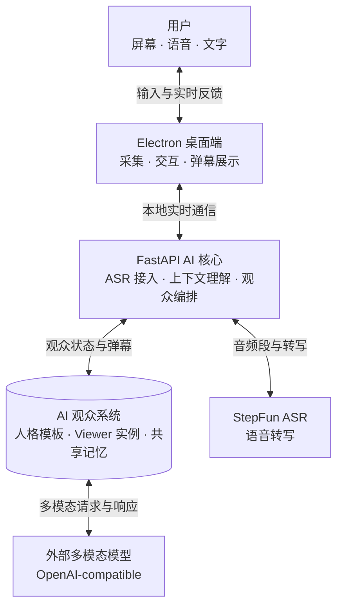

# 系统架构

> 状态：Architecture Baseline
>
> 第一版技术基线：Electron + React + TypeScript、FastAPI + `uv`、StepFun Step Plan ASR、OpenAI-compatible Model Provider。
>
> 更新日期：2026-07-24
>
> AI 观众发言行为以 [AUDIENCE_SPEAKING_PRODUCT_SPEC.md](./AUDIENCE_SPEAKING_PRODUCT_SPEC.md) 为准。本文中任何 Director、中心选人、画面变化直接触发或展示配额相关的描述均为历史设计，不代表当前实现。

## 1. 架构目标

系统需要稳定完成以下实时链路：



架构优先保证：

- Electron UI 不因 ASR、模型或网络故障而失去控制能力。
- 采集、ASR、上下文、模型接入和渲染可以独立替换和测试。
- 外部服务供应商的协议不会扩散到业务模块。
- 旧观察和旧会话的结果不会在错误时间显示。
- Windows 和 macOS 可以使用不同的系统实现，但共享领域合同。
- 用户停止后，采集和异步任务能够真正结束。

## 2. 总体边界

系统由两个主要运行时组成。

### 2.1 Electron 桌面端

Electron 负责与操作系统和用户界面直接相关的能力：

- 使用 React 实现控制台、设置和运行状态。
- 屏幕或窗口来源选择。
- 麦克风选择与授权。
- 屏幕帧和麦克风音频采集。
- 透明弹幕覆盖层。
- 托盘、快捷键和恢复入口。
- 启动、监督和停止本地 FastAPI 后端。
- 平台安全存储能力的接入。

Renderer 不应直接持有 ASR 或模型凭据，也不应直接调用外部服务。

### 2.2 FastAPI 本地后端

FastAPI 负责本地计算和 AI 编排：

- 会话生命周期。
- 接收有界的画面帧和音频数据。
- ASR Provider 调度。
- 近期画面与转写缓冲。
- 用户文字、语音转写和公开弹幕组成的房间事件流。
- 稳定 Viewer 池、实例短期状态和 Room 共享记忆。
- 模式、模式内人格覆盖和成长梗库的持久状态。
- `ObservationWave` 和可配置历史画面包构建。
- Director 调度、独立 Viewer 请求和并发控制。
- Model Provider 调用、取消、超时和错误归一化。
- 弹幕结构校验、时效检查、去重和内容过滤。
- 向 Electron 输出状态和弹幕事件。
- 机器可读 Debug Trace、headless harness 和 replay。

FastAPI 是本机应用组件，不等同于公开部署的云后端。是否在未来提供远程后端，需要单独决策。

Python 项目使用 `uv` 管理解释器要求、依赖和锁文件。生产构建携带自己的 Python Runtime，不依赖用户机器的全局 Python 环境。

## 3. Electron 模块

### 3.1 Main Process

Main Process 是桌面生命周期和敏感能力的权威：

- 创建和销毁控制窗、采集组件及 Overlay。
- 管理系统权限、快捷键、托盘和应用退出。
- 启动 FastAPI 子进程并验证其健康状态。
- 后端未就绪时向界面发布明确的启动状态；意外退出时限次自动恢复，并提供手动重试。
- 为每次启动创建短期本地连接凭证，避免其他本机网页随意调用后端。
- 按来源限制 IPC 能力。
- 处理无条件可用的暂停、清屏和停止命令。

Main Process 不负责运行 ASR 或解释模型输出。

### 3.2 Control UI

Control UI 使用 React + TypeScript，只显示状态并收集用户意图：

- 来源、麦克风、模型和弹幕设置。
- 用户文字弹幕输入、单一激活模式、模式内观众和观众状态。
- 内置模式复制、自定义模式和完整人格编辑。
- 版本化 `personality.md` 的校验，以及当前模式成长梗库的管理和自动入库撤销。
- 采集、ASR、模型及生成状态。
- 开始、暂停、恢复、清屏、隐藏和停止操作。

它通过最小化的 preload API 与 Main Process 通信，不获得 Node 通用访问能力。

### 3.3 Capture

Capture 负责把系统媒体能力转换为内部数据：

- 通过 Electron/Chromium Media API 获取用户授权的屏幕或窗口视频轨道。
- 通过 Electron/Chromium Media API 获取用户选择的麦克风音频轨道。
- 对画面进行缩放、编码、节流和必要的变化检测。
- 通过 AudioWorklet 对音频进行 ASR 所需的格式转换和有界分块。
- 在暂停、来源结束或停止时释放轨道和缓冲。

采样频率、图像尺寸、编码格式和音频块长度属于运行参数，需要实测后配置，不能写死在领域合同中。

第一版不让 Python 直接访问麦克风，也不引入平台原生采集模块。只有 Electron API 在目标平台实测无法满足要求时，才为对应系统增加窄范围原生适配。

### 3.4 Overlay

Overlay 是纯渲染终端：

- 只接收已经通过后端或桌面边界校验的弹幕命令。
- 负责移动、轨道、样式、屏幕范围和清屏。
- 默认不获取屏幕、麦克风、模型配置或凭据。
- 直播状态下尽可能点击穿透，不影响下方应用操作。

Overlay 失效时，用户仍需能够通过控制窗、托盘或快捷键停止会话。

## 4. FastAPI 模块

本节固定主要业务边界。模块依赖、目标目录、运行时处理流程和 SQLite Schema 的详细设计见 [BACKEND_DESIGN.md](./BACKEND_DESIGN.md)。

### 4.1 Session Service

Session Service 维护当前会话状态和唯一标识。所有帧、转写、模型请求和弹幕事件都属于一个明确会话。

新会话开始或旧会话停止后，来自旧会话的异步结果必须被丢弃。

建议状态如下，具体命名可以在实现时调整：

```text
idle -> starting -> running <-> paused -> stopping -> idle
                      |
                      v
                    error
```

错误状态不能阻止用户进入 `stopping`。

### 4.2 ASR Provider

业务层依赖 `AsrProvider`，而不是具体 ASR 服务协议。

概念接口：

```python
class AsrProvider(Protocol):
    async def start(self, config: AsrConfig) -> None: ...
    async def push_audio(self, chunk: AudioChunk) -> None: ...
    async def commit(self) -> None: ...
    async def results(self) -> AsyncIterator[TranscriptSegment]: ...
    async def stop(self) -> None: ...
```

`TranscriptSegment` 至少包含：

- 所属会话。
- 文本。
- 开始和结束时间。
- 是否为最终结果。

第一版实现 `StepFunAsrProvider`，通过 Step Plan 的 HTTP + SSE 接口调用 `stepaudio-2.5-asr`。Electron 将麦克风音频转换为单声道 16 kHz PCM S16LE 并通过本地数据面发送给 FastAPI；Provider 在音频段提交后编码请求，并把供应商的增量、最终和错误事件转换为统一结果。

Step Plan 接口一次提交一个有限音频段，不提供持续上传音频的双向流。`commit()` 只表示当前音频段结束，不规定使用静音检测、固定窗口或其他分段算法。Provider 串行处理已提交片段，避免后提交的语音先成为房间事件。具体分段方式和时长需要通过延迟与准确率实测决定。

每个最终转写会转换为来源为 `user_voice` 的 `RoomEvent`。用户从 React UI 发送的文字则由 Main/FastAPI 校验后转换为 `user_text` 事件；两者在对话中地位相同，但保留来源信息。

StepFun 的 endpoint、model、鉴权和 SSE 事件只存在于 Adapter 内。业务层和跨进程合同不出现供应商字段；如果 Step Plan 延迟不能满足体验，可以新增双向流式 ASR Adapter，而不修改房间事件和 Audience Engine。

### 4.3 Room 与观众模型

房间内公开发生的内容使用统一事件表示：

```python
class RoomEvent(TypedDict):
    room_id: str
    event_id: str
    session_id: str
    audience_epoch: int
    source_type: str
    source_id: str | None
    created_at_ms: int
    text: str | None
    payload: dict[str, object]
```

`source_type` 至少区分 `user_text`、`user_voice`、`audience_barrage`、`screen_observation` 和 `system_event`。用户文字无需等待模型即可作为用户弹幕显示，同时进入后续观众上下文。

`PersonaTemplate` 是跨会话可编辑模板，`ViewerInstance` 才是当前 Session 中真正独立的 AI 观众：

```python
class ViewerInstance(TypedDict):
    viewer_instance_id: str
    session_id: str
    username: str
    avatar_seed: str
    persona_id: str
    persona_revision: int
    creation_ordinal: int
    instance_variant: dict[str, object]
    presence_state: str
    presence_revision: int
    moderation_revision: int
    behavior_revision: int
    viewer_sequence: int

class RoomLongTermMemory(TypedDict):
    memory_id: str
    room_id: str
    memory_type: str
    content: str
    evidence_event_ids: list[str]
    revision: int
    state: str
    created_at_ms: int
    updated_at_ms: int
```

同一 `PersonaTemplate` 可以创建多个 ViewerInstance；实例使用确定性别名和微变体区分。Persona 只影响观察重点、口吻和行为边界，不拥有私有长期事实。所有 Viewer 读取同一 `RoomLongTermMemory`，每波只检索相关切片；实例自己的近期已公开发言、被点名互动、临时情绪、注意点和冷却保存在 `ViewerPrivateState`，不复制整份房间历史。

所有成功公开的弹幕进入 `RoomWorkingMemory`，从下一波起对全部 Viewer 可见。用户事实必须有用户文字、最终语音、可信画面事件或系统事件作为证据；AI 互动只能独立形成 `room_lore` 或共同经历，不能单独证明现实事实。

### 4.4 模式与人格合同

观众产品状态按“模式 > PersonaTemplate 引用与覆盖 > SessionAudience > ViewerInstance > 成长梗库”分层。现有 32 个基础人格继续作为首版内置模板库；同时 active Viewer 上限为 32，同一 Session 内已创建 Viewer 另有有界上限。同一 PersonaTemplate 可以赋予多个实例。

模式保存 `target_concurrent_viewers`、`persona_weights`、模式内人格覆盖、普通/高光响应人数范围和 ambient 行为。目标在线人数范围为 1 到 32；Persona 权重只在创建新 Viewer 时决定 assignment。Mode 热更新保留 ViewerIdentity，不按 Persona 席位重建身份。状态中只能存在一个 `active_mode_id`，不能把多个模式合并为同一运行快照。

运行时人格按“当前版本内置模板 -> 当前模式覆盖”解析。覆盖不能反写基础模板，也不能影响其他模式。内置模式保留可恢复基线，用户既可以直接调整后重置，也可以复制为新的自定义模式继续编辑。

完整人格编辑器覆盖人格的稳定 ID、显示信息、角色、颜色、特征、表达方式、行为约束、触发与避用偏好、沉默/爆发/复读倾向、冷却与单轮上限、内容标记和启用状态。人格导入导出使用 `personality.md`；文档格式携带明确版本并在应用边界校验，未知版本或不完整字段不能静默进入运行状态。

本节首先约束 Electron/React 与桌面共享 TypeScript 类型。Electron 是可编辑 PersonaTemplate、ModeDefinition 和 Provider 设置的权威；结构化、版本化对象是规范状态，模式目录中的 `personality.md` 是可重新生成的导入导出表示。后端通过完整 canonical runtime spec、revision、hash 和 `apply_id` 接收版本化快照，在 `ObservationWave` 边界原子应用并递增 `audience_epoch`。应用失败继续使用旧版本，不允许半更新；旧 epoch 的请求和候选必须零副作用。

### 4.5 ObservationWave 与 Context Builder

Context Builder 维护有界的近期上下文：

- 带时间信息和内容 hash 的历史画面帧。
- 用户文字、最终语音转写和近期已显示弹幕组成的房间事件。
- Room 共享记忆的相关切片。
- 用户明确配置的主题、模式和风格信息。

它生成可重放、同波冻结的 `ObservationWave`。概念结构如下：

```python
class ObservationWave(TypedDict):
    room_id: str
    session_id: str
    audience_epoch: int
    observation_id: str
    created_at_ms: int
    deadline_at_ms: int
    trigger_event_ids: list[str]
    frame_bundle: FrameBundle
    room_event_ids: list[str]
    room_memory_revision: int
```

同一波的 Director 和全部 Viewer 使用同一份 public context snapshot；同波先返回的弹幕不会改变慢 Viewer 的输入，只能从下一波起进入共享上下文。

`FrameBundle` 默认采用 `change_peaks + 3`，并允许热更新历史张数、时间窗、`latest_n` / `evenly_spaced` / `change_peaks` 策略、最大尺寸和质量。默认 `direct_frames` 让每个选中 Viewer 独立看到同一画面包；`shared_summary` 只复用视觉摘要，不合并 Viewer 请求。两种模式由用户手动切换，首版不自动降级。

正式触发源包括用户文字、最终语音、超过阈值且满足冷却的画面变化，以及连续模式下的有界 ambient tick。相近输入合并成一波；ASR 部分结果只用于 UI 和调试，最终转写以稳定 utterance ID 幂等入房间事件。AI 弹幕不能直接递归触发新波；长时间没有真实输入时必须强制安静。

### 4.6 Audience Engine

Audience Engine 先由本地预算器根据事件类型、模式响应范围和 Provider 压力得到本波硬上限，再调用一次 Director。Director 输出不绑定具体 Viewer 的 `SceneAssessment` 和可选 `MemeCandidate`，不能生成弹幕正文。每个 Viewer 再由本地 `ViewerBehaviorService` 根据在场/禁言状态、Persona、实例微变体、冷却、短期状态、场景相关度和 crowd pressure 计算可解释的发言概率，并使用 Session seed 下的稳定抽样决定是否进入预算。

每个被选中的 ViewerInstance 创建一个独立 Provider 请求，并收到：

- 完整 PersonaTemplate、模式覆盖和稳定实例微变体。
- 冻结的 `ObservationWave`、画面包或共享视觉摘要。
- 同波一致的 public context 和 Room 长期记忆核心切片。
- 仅属于该实例的 `ViewerPrivateState`。
- `session_id`、`audience_epoch`、`viewer_sequence`、presence/moderation/behavior revisions 和 deadline。

首版明确要求：

- 不把多个 Viewer 合并为一个 prompt，也不使用多 Viewer batching。
- 每个 Viewer 每波只返回 `action=barrage|silence`；`barrage` 最多一条，沉默是合法结果。
- 初始 Viewer 请求并发上限为 12，可配置范围为 1 到 32；超出部分进入有界队列。
- TTL 从波创建时开始；每个 Viewer 使用 latest-wins，旧 epoch、旧 sequence、过期、取消和非法结果零副作用。
- 瞬时网络错误、429 或 5xx 仅在 TTL 允许时重试同一 Viewer 一次，不换人补位。
- 合法结果按完成顺序独立发布，语义近似重复时保留最早通过者。
- 限时禁言、离开和踢出会取消该 Viewer 的 mailbox；最终围栏要求 Viewer 仍 active、未禁言且三个 revision 全部匹配。

`SessionAudience` 是本场观众的权威边界，维护 session seed、目标在线人数、已知/active Viewer、下一个 creation ordinal 和 population revision。Viewer 可以离开和同场重返；被踢 Viewer 本场不可恢复并由新身份补位。正常停止后当前 audience 为空且私有行为状态清理，崩溃恢复同一未终止 Session 时则恢复原 Viewer。

文字 `@` 通过自动补全传递结构化 Viewer 或 Persona 目标；最终语音由可追踪 mention resolver 解析。高置信实例目标必须成为选择约束，Persona 目标至少选择该模板的一个实例，歧义目标按普通房间发言处理。

`MemeCandidate` 是与弹幕候选分离的领域对象。它可以从用户文字、最终语音转写、近期真实事件或已经发生的 AI 互动中提议梗内容；导演判断成立且本地校验通过后，候选自动写入当时的激活模式。自动写入必须可撤销，持久条目需要支持衰减和归档。

`MemeCandidate` 不能转换为 `BarrageEvent`、写成 `audience_barrage`，也不能直接发送给 Overlay。只有已入库梗在后续被某个明确观众用于合法生成时，才进入常规弹幕管线。

Director 提供 strict 和 resilient 两种失败策略。strict 模式在导演失败时保持安静并暴露机器错误，用于开发和真实验收；resilient 模式使用确定性本地 fallback，并显式标记 `decision_source=fallback`。不得复用上一波决定。

### 4.7 Model Provider

所有外部模型通过 `ModelProvider` 适配器调用：

```python
class ModelProvider(Protocol):
    async def health(self) -> ProviderHealth: ...
    async def generate(self, request: ModelRequest) -> ModelResult: ...
    async def cancel(self, request_id: str) -> None: ...
```

Provider Adapter 负责：

- 将统一观察转换为供应商请求格式。
- 注入用户配置的 endpoint、model 和凭据。
- 处理同步、流式或其他响应形式。
- 将供应商错误归一化为领域错误。
- 支持超时和尽可能及时的取消。
- 声明模型是否支持图像、支持的格式和请求限制。

第一版实现一个启用中的 OpenAI-compatible Provider profile，允许用户配置 `base_url`、凭据和 `director`、`viewer`、`memory`、`visual_summary` 角色模型 ID。角色模型默认继承同一模型，高级设置可以覆盖。默认使用非流式短结构结果；Adapter 在连接检查时通过 `/v1/models` 和最小 capability probe 探测模型、图像、结构化输出、限制和错误行为，不能因为服务自称兼容就假设所有可选字段均可用。

Director、Viewer、Memory 和 Visual Summary 使用相同 Adapter，但请求合同按角色区分。每个 ViewerInstance 始终对应一个独立逻辑 `GenerationRequest`；首版不允许多 Viewer batching。endpoint、凭据或角色模型热更新必须先探测成功，再随 runtime revision 原子应用；失败继续使用旧 revision。

业务层不能出现 OpenAI-compatible 或其他供应商的 wire 字段。未来增加其他协议时，应新增 Adapter，不修改 Observation、Audience Engine 或 Barrage Pipeline。

允许用户配置任意外部地址会带来网络和凭据风险。应用只能向用户明确启用的地址发送数据，并需要在界面展示当前目的地。

### 4.8 Barrage Pipeline

模型结果必须经过本地管线后才能显示：

```text
raw result
  -> structure validation
  -> viewer identity validation
  -> session, epoch, observation and sequence check
  -> expiration check
  -> evidence validation
  -> content policy
  -> duplicate and density control
  -> BarrageEvent
```

管线入口只接受归属于明确观众的弹幕候选。导演的 `MemeCandidate` 即使通过梗库入库校验，也不属于弹幕候选，必须由类型和边界检查拒绝直接进入此管线。

概念事件：

```python
class BarrageEvent(TypedDict):
    barrage_id: str
    room_id: str
    session_id: str
    audience_epoch: int
    observation_id: str
    generation_request_id: str
    viewer_instance_id: str
    persona_id: str
    viewer_sequence: int
    reaction_type: str
    evidence_refs: list[str]
    text: str
    created_at_ms: int
    expires_at_ms: int
    style: dict[str, object]
    metadata: dict[str, object]
```

模型不必直接生成全部字段。本地系统补充弹幕 ID、身份、版本、时间、样式和其他可信元数据；Provider 不能自行指定或改挂 Viewer 身份。

通过检查并公开显示的 AI 弹幕会写入来源为 `audience_barrage` 的 `RoomEvent`，供用户和其他观众后续交流。是否同时产生关系或记忆更新，需要走独立的数据写入流程，不能把模型自由文本直接当作可信记忆。

第一版内容管线在本地完成结构、长度、时效、重复、用户屏蔽词和基础硬规则检查。过滤异常时丢弃候选，不接入外部内容审核服务。

## 5. 本地通信

Electron 与 FastAPI 之间需要两类通信：

- 控制面：健康检查、配置校验与应用、回滚、开始、暂停、停止、恢复、状态快照和 Debug API。
- 数据面：画面帧、音频块、用户文字、转写状态、ObservationWave、房间事件、弹幕事件和 trace 状态。

第一版采用以下组合：

- HTTP：健康检查、配置、Provider capability probe、会话控制、Debug 查询和 replay 控制。
- WebSocket：音频块、代表帧、用户文字、实时状态、房间事件和弹幕事件。

无论采用哪种传输，都必须满足：

- 只监听回环地址，不默认暴露局域网端口。
- 每次应用启动使用不可预测的短期鉴权信息。
- 校验消息大小、类型、协议版本、`room_id`、会话 ID、epoch 和来源。
- 音频和图像队列有界；新数据可以覆盖已经失去价值的旧数据。
- Electron 退出时后端随之退出，不留下孤立进程。

端口选择和路径由启动时配置。FastAPI/Pydantic 是控制消息和事件 Schema 的来源，并生成 TypeScript 类型或客户端；WebSocket 事件同样携带协议版本，不能在两端长期手写重复合同。

## 6. 配置与凭据

配置分为五类：

| 类型         | 示例                               | 存储原则                               |
| ------------ | ---------------------------------- | -------------------------------------- |
| 普通设置     | 弹幕样式、来源偏好、语言           | 保存在本地配置文件                     |
| 模式内容     | 模式定义、模式内人格覆盖           | Electron 保存版本化工作区              |
| Viewer 状态  | 实例身份、微变体、短期状态和冷却   | 后端 Session 内管理，必要结构可恢复     |
| Room 状态    | 工作记忆、长期记忆和来源           | 后端按 `room_id` 持久化，可查看和删除   |
| 成长梗       | ModeMeme 和事件日志                | 后端按 mode namespace 隔离，可撤销      |
| 外部服务设置 | ASR/模型 Provider、endpoint、model | 可本地持久化并可编辑                   |
| 敏感凭据     | API Key、访问令牌                  | 使用平台安全存储，不进入普通配置和日志 |

ASR 和模型凭据由 Electron Main 通过 `safeStorage` 保存。Renderer 不读取已保存的明文凭据；Main 使用本次启动的短期鉴权通道将当前会话所需凭据注入 FastAPI 内存，停止后清理。凭据不得进入命令行参数、环境变量、普通配置和日志。

控制界面必须展示当前启用的 ASR 服务，并在开始采集前说明麦克风音频会发送到 StepFun。原始音频默认不持久化，也不得写入日志；弹幕生成模型只接收最终转写文本。

第一版没有账号或云同步。目标架构使用 SQLite 持久化 Room、最小会话记录、runtime revisions、Viewer 池结构、有界可恢复的公开结构事件、Room 长期记忆与证据、ModeMeme 及其事件日志，并通过版本化迁移管理 Schema。原始音频、完整画面、隐藏推理、完整 Prompt、Provider 原始响应和凭据不写入数据库或 Debug Trace。Electron 和 FastAPI 使用结构化本地日志及机器可读 trace，通过 `room_id`、`session_id`、`audience_epoch`、`observation_id`、`generation_request_id` 和 `viewer_instance_id` 关联事件。

Room 长期记忆只保存从公开房间事件中提炼的必要事实、共同经历或关系摘要，并保留来源事件引用、类型和 revision。用户删除、撤销或修改记忆后，后续上下文不得继续使用旧值。波次完成后的异步提取不阻塞弹幕发布。

## 7. 取消、背压与时效

- 每项异步工作携带 `session_id`、`audience_epoch`、`observation_id`、`viewer_sequence`、创建时间和 deadline。
- 停止会话、热更新或恢复时取消对应任务，并让旧 epoch 立即失效。
- 每个 Viewer 最多一个执行中请求和一个等待中的最新请求；新波覆盖其尚未执行的旧任务。
- 模型返回后先检查 Session、epoch、Viewer、sequence、deadline、取消状态和 evidence，再允许展示或写入状态。
- Provider 限流或故障时不允许无限重试或无界排队；初始 Viewer 并发为 12，范围 1 到 32。
- 弹幕队列达到上限时优先丢弃旧的、低优先级的内容。

具体并发、队列长度、超时和 TTL 是配置与实测结果，不是固定架构常量。

## 8. 故障语义

| 故障               | 系统行为                                            |
| ------------------ | --------------------------------------------------- |
| 屏幕来源结束       | 停止使用旧画面，提示用户重新选择或停止会话          |
| 麦克风断开         | 停止 ASR，明确进入仅画面状态或结束会话              |
| ASR 失败或网络中断 | 不把不稳定文本送入模型，保留文字输入、控制和停止能力 |
| Provider 不可用    | 停止新的模型请求，显示明确状态，不伪造上下文弹幕    |
| 模型输出非法       | 丢弃本次候选并记录脱敏错误                          |
| Viewer ID、epoch 或 sequence 非法 | 丢弃候选，不更新任何状态                  |
| 记忆存储不可用     | 保持会话内交流，停止长期记忆写入并提示降级          |
| FastAPI 崩溃       | Electron 保持可控，停止采集并尝试有界恢复或结束会话 |
| Overlay 崩溃       | 后端可继续停止，用户通过独立入口恢复或结束          |

## 9. 跨平台边界

需要分别验证：

- 屏幕录制和麦克风权限流程。
- 窗口/显示器枚举与来源结束事件。
- 透明置顶窗口和鼠标穿透。
- 多 DPI、Retina 和坐标换算。
- 全局快捷键、托盘和应用退出。
- FastAPI 和 Python Runtime 的打包与签名。
- 操作系统休眠、锁屏和设备热插拔后的行为。

平台适配应位于 Electron 系统层或打包层，不能让 Windows/macOS 分支扩散到 Audience Engine 和 Model Provider。

## 10. 测试边界

- 领域单元测试：ObservationWave 合并与冻结、会话/epoch 失效、TTL、latest-wins、去重和调度。
- Viewer 状态测试：确定性池分配、稳定实例 ID、微变体、点名路由、短期状态协调和模式切换。
- 模式合同测试：六个内置模式、1 到 32 个 Viewer 上限、权重分配、单一激活、覆盖隔离、复制和 `personality.md` 版本校验。
- Shared Brain 测试：下一波共享可见、跨 Session/模式 Room 记忆、证据约束、异步提取和删除生效。
- 成长梗库测试：来源归一化、当前模式隔离、自动入库撤销、持久恢复、衰减归档，以及 `MemeCandidate` 不能直接成为弹幕。
- Provider 合同测试：角色模型探测、独立 Viewer 请求、沉默、非法输出、超时、取消、限流、一次重试和断流。
- ASR 合同测试：音频格式、SSE 分片、部分结果、最终结果、超时、限流、断流和停止。
- Electron 集成测试：开始、暂停、清屏、热更新、回滚、停止和后端恢复。
- Headless/replay 测试：固定 seed、虚拟时钟、隔离数据目录、recorded replay、live replay 显式开关和稳定退出码。
- 两个平台的真实系统测试：权限、点击穿透、采集释放和打包启动。
- 端到端测试：固定 CS2/CSGO fixture、真实屏幕、真实麦克风、StepFun ASR 和至少一个真实外部模型。

模拟服务可以覆盖错误路径，但不能代替最终的真实多模态验收。

## 11. 明确未定的实现

- Python Runtime 使用哪种目录式冻结工具随 Electron 分发。
- 麦克风音频的分段方式，以及 Step Plan SSE 的延迟是否满足实时互动体验。
- 屏幕帧在进程间使用何种编码和压缩。
- 双平台实测后采用哪个成熟弹幕库。
- 画面变化阈值、ambient 间隔、响应人数预算、并发、队列和 TTL 的调优值。
- Room 长期记忆的提取、合并、冲突、遗忘和检索排序细节。
- 遥测、崩溃上报和自动更新方案。

这些事项经过 Spike 或实现验证后，在 [DECISIONS.md](./DECISIONS.md) 中记录决定。
