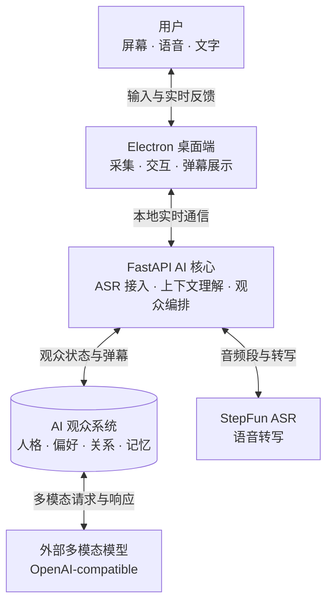

# 系统架构

> 状态：Architecture Baseline
>
> 第一版技术基线：Electron + React + TypeScript、FastAPI + `uv`、StepFun Step Plan ASR、OpenAI-compatible Model Provider。

## 1. 架构目标

系统需要稳定完成以下实时链路：



架构优先保证：

- Electron UI 不因 ASR、模型或网络故障而失去控制能力。
- 采集、ASR、上下文、模型接入和渲染可以独立替换和测试。
- 外部服务供应商的协议不会扩散到业务模块。
- 旧观察和旧会话的结果不会在错误时间显示。
- Windows 和 macOS 可以使用不同的系统实现，但共享领域合同。
- 用户停止后，采集和异步任务能够真正结束。

## 2. 总体边界

系统由两个主要运行时组成。

### 2.1 Electron 桌面端

Electron 负责与操作系统和用户界面直接相关的能力：

- 使用 React 实现控制台、设置和运行状态。
- 屏幕或窗口来源选择。
- 麦克风选择与授权。
- 屏幕帧和麦克风音频采集。
- 透明弹幕覆盖层。
- 托盘、快捷键和恢复入口。
- 启动、监督和停止本地 FastAPI 后端。
- 平台安全存储能力的接入。

Renderer 不应直接持有 ASR 或模型凭据，也不应直接调用外部服务。

### 2.2 FastAPI 本地后端

FastAPI 负责本地计算和 AI 编排：

- 会话生命周期。
- 接收有界的画面帧和音频数据。
- ASR Provider 调度。
- 近期画面与转写缓冲。
- 用户文字、语音转写和公开弹幕组成的房间事件流。
- 稳定观众档案、关系状态和观众独立记忆。
- 观察上下文构建。
- AI 观众生成策略。
- Model Provider 调用、取消、超时和错误归一化。
- 弹幕结构校验、时效检查、去重和内容过滤。
- 向 Electron 输出状态和弹幕事件。

FastAPI 是本机应用组件，不等同于公开部署的云后端。是否在未来提供远程后端，需要单独决策。

Python 项目使用 `uv` 管理解释器要求、依赖和锁文件。生产构建携带自己的 Python Runtime，不依赖用户机器的全局 Python 环境。

## 3. Electron 模块

### 3.1 Main Process

Main Process 是桌面生命周期和敏感能力的权威：

- 创建和销毁控制窗、采集组件及 Overlay。
- 管理系统权限、快捷键、托盘和应用退出。
- 启动 FastAPI 子进程并验证其健康状态。
- 为每次启动创建短期本地连接凭证，避免其他本机网页随意调用后端。
- 按来源限制 IPC 能力。
- 处理无条件可用的暂停、清屏和停止命令。

Main Process 不负责运行 ASR 或解释模型输出。

### 3.2 Control UI

Control UI 使用 React + TypeScript，只显示状态并收集用户意图：

- 来源、麦克风、模型和弹幕设置。
- 用户文字弹幕输入、观众名单和观众状态。
- 采集、ASR、模型及生成状态。
- 开始、暂停、恢复、清屏、隐藏和停止操作。

它通过最小化的 preload API 与 Main Process 通信，不获得 Node 通用访问能力。

### 3.3 Capture

Capture 负责把系统媒体能力转换为内部数据：

- 通过 Electron/Chromium Media API 获取用户授权的屏幕或窗口视频轨道。
- 通过 Electron/Chromium Media API 获取用户选择的麦克风音频轨道。
- 对画面进行缩放、编码、节流和必要的变化检测。
- 通过 AudioWorklet 对音频进行 ASR 所需的格式转换和有界分块。
- 在暂停、来源结束或停止时释放轨道和缓冲。

采样频率、图像尺寸、编码格式和音频块长度属于运行参数，需要实测后配置，不能写死在领域合同中。

第一版不让 Python 直接访问麦克风，也不引入平台原生采集模块。只有 Electron API 在目标平台实测无法满足要求时，才为对应系统增加窄范围原生适配。

### 3.4 Overlay

Overlay 是纯渲染终端：

- 只接收已经通过后端或桌面边界校验的弹幕命令。
- 负责移动、轨道、样式、屏幕范围和清屏。
- 默认不获取屏幕、麦克风、模型配置或凭据。
- 直播状态下尽可能点击穿透，不影响下方应用操作。

Overlay 失效时，用户仍需能够通过控制窗、托盘或快捷键停止会话。

## 4. FastAPI 模块

### 4.1 Session Service

Session Service 维护当前会话状态和唯一标识。所有帧、转写、模型请求和弹幕事件都属于一个明确会话。

新会话开始或旧会话停止后，来自旧会话的异步结果必须被丢弃。

建议状态如下，具体命名可以在实现时调整：

```text
idle -> starting -> running <-> paused -> stopping -> idle
                      |
                      v
                    error
```

错误状态不能阻止用户进入 `stopping`。

### 4.2 ASR Provider

业务层依赖 `AsrProvider`，而不是具体 ASR 服务协议。

概念接口：

```python
class AsrProvider(Protocol):
    async def start(self, config: AsrConfig) -> None: ...
    async def push_audio(self, chunk: AudioChunk) -> None: ...
    async def commit(self) -> None: ...
    async def results(self) -> AsyncIterator[TranscriptSegment]: ...
    async def stop(self) -> None: ...
```

`TranscriptSegment` 至少包含：

- 所属会话。
- 文本。
- 开始和结束时间。
- 是否为最终结果。

第一版实现 `StepFunAsrProvider`，通过 Step Plan 的 HTTP + SSE 接口调用 `stepaudio-2.5-asr`。Electron 将麦克风音频转换为单声道 16 kHz PCM S16LE 并通过本地数据面发送给 FastAPI；Provider 在音频段提交后编码请求，并把供应商的增量、最终和错误事件转换为统一结果。

Step Plan 接口一次提交一个有限音频段，不提供持续上传音频的双向流。`commit()` 只表示当前音频段结束，不规定使用静音检测、固定窗口或其他分段算法。Provider 串行处理已提交片段，避免后提交的语音先成为房间事件。具体分段方式和时长需要通过延迟与准确率实测决定。

每个最终转写会转换为来源为 `user_voice` 的 `RoomEvent`。用户从 React UI 发送的文字则由 Main/FastAPI 校验后转换为 `user_text` 事件；两者在对话中地位相同，但保留来源信息。

StepFun 的 endpoint、model、鉴权和 SSE 事件只存在于 Adapter 内。业务层和跨进程合同不出现供应商字段；如果 Step Plan 延迟不能满足体验，可以新增双向流式 ASR Adapter，而不修改房间事件和 Audience Engine。

### 4.3 Room 与观众模型

房间内公开发生的内容使用统一事件表示：

```python
class RoomEvent(TypedDict):
    event_id: str
    session_id: str
    source_type: str
    source_id: str | None
    created_at_ms: int
    text: str | None
    payload: dict[str, object]
```

`source_type` 至少区分 `user_text`、`user_voice`、`audience_barrage`、`screen_observation` 和 `system_event`。用户文字无需等待模型即可作为用户弹幕显示，同时进入后续观众上下文。

每个观众是稳定逻辑实体：

```python
class AudienceMember(TypedDict):
    audience_id: str
    display_name: str
    avatar_ref: str | None
    personality: dict[str, object]
    preferences: dict[str, object]
    speaking_style: dict[str, object]
    relationships: dict[str, object]
    enabled: bool

class AudienceMemory(TypedDict):
    memory_id: str
    audience_id: str
    content: str
    source_event_ids: list[str]
    created_at_ms: int
    updated_at_ms: int
```

`AudienceMember` 的核心人格和偏好由本地状态管理，不允许模型直接覆盖。动态心情、关系变化和长期记忆需要经过独立校验与写入流程；一个观众的私有记忆不能无条件出现在其他观众的上下文中。

### 4.4 Context Builder

Context Builder 维护有界的近期上下文：

- 带时间信息的画面帧。
- 用户文字、最终语音转写和近期已显示弹幕组成的房间事件。
- 用户明确配置的主题和风格信息。

它生成不可变的 `Observation`。概念结构如下：

```python
class Observation(TypedDict):
    session_id: str
    observation_id: str
    created_at_ms: int
    frames: list[FrameRef]
    room_events: list[RoomEvent]
    user_context: dict[str, str]
```

`Observation` 不规定固定帧数或固定时间窗。构建策略可以根据画面变化、模型限制和实际延迟选择上下文。

画面可以使用定时缩略帧和简单差异去重，不引入 OpenCV、目标检测或游戏专用事件识别。具体由哪些房间事件触发生成、多久触发、选取哪些观众以及如何处理空闲期暂不确定；调度器只需保证队列有界，并丢弃已经失去时效的观察。

### 4.5 Audience Engine

Audience Engine 决定何时生成、使用哪种观众策略，以及将结果转换为弹幕候选。

在每次生成中，它需要为候选观众提供：

- 稳定的观众档案。
- 当前会话状态与近期公开事件。
- 只属于该观众的相关长期记忆。
- 该观众与用户及其他观众的关系状态。

它不应假设：

- 必须存在固定数量的人格。
- 每个人格必须独立调用模型。
- 必须存在单独的人群导演模型。
- 每次观察必须产生弹幕。

无论一次请求处理一个还是多个观众，模型输出都必须显式引用已有 `audience_id`。本地系统校验身份后才能展示或写入记忆，模型不能临时创造一个无档案观众冒充房间成员。

选择哪些观众、发言时机、批量或独立调用、观众彼此接话和记忆更新时机均属于开放的调度算法。架构只固定观众拥有独立逻辑状态和隔离记忆，不固定模型调用拓扑，也不引入通用多 Agent 框架。

### 4.6 Model Provider

所有外部模型通过 `ModelProvider` 适配器调用：

```python
class ModelProvider(Protocol):
    async def health(self) -> ProviderHealth: ...
    async def generate(
        self,
        observation: Observation,
        request: GenerationRequest,
    ) -> GenerationResult: ...
    async def cancel(self, request_id: str) -> None: ...
```

Provider Adapter 负责：

- 将统一观察转换为供应商请求格式。
- 注入用户配置的 endpoint、model 和凭据。
- 处理同步、流式或其他响应形式。
- 将供应商错误归一化为领域错误。
- 支持超时和尽可能及时的取消。
- 声明模型是否支持图像、支持的格式和请求限制。

第一版实现 OpenAI-compatible 多模态 Adapter，允许用户配置 `base_url`、`model` 和凭据。默认使用非流式短结构结果；Adapter 在连接检查时探测图像、结构化输出、限制和错误行为，不能因为服务自称兼容就假设所有可选字段均可用。

`GenerationRequest` 携带本轮候选观众及各自隔离的状态。`GenerationResult` 中每条候选必须带 `audience_id`；如果一次批量调用无法可靠保持人格和记忆隔离，Audience Engine 可以改用独立调用，而不改变 Provider 接口的业务语义。

业务层不能出现 OpenAI-compatible 或其他供应商的 wire 字段。未来增加其他协议时，应新增 Adapter，不修改 Observation、Audience Engine 或 Barrage Pipeline。

允许用户配置任意外部地址会带来网络和凭据风险。应用只能向用户明确启用的地址发送数据，并需要在界面展示当前目的地。

### 4.7 Barrage Pipeline

模型结果必须经过本地管线后才能显示：

```text
raw result
  -> structure validation
  -> audience identity validation
  -> session and observation check
  -> expiration check
  -> content policy
  -> duplicate and density control
  -> BarrageEvent
```

概念事件：

```python
class BarrageEvent(TypedDict):
    barrage_id: str
    session_id: str
    observation_id: str
    audience_id: str
    text: str
    created_at_ms: int
    expires_at_ms: int
    style: dict[str, object]
    metadata: dict[str, object]
```

模型不必直接生成全部字段。本地系统可以补充弹幕 ID、时间、样式和其他可信元数据，但 `audience_id` 必须来自本轮明确提供的候选观众，不能在验证后随意改挂到其他身份。

通过检查并公开显示的 AI 弹幕会写入来源为 `audience_barrage` 的 `RoomEvent`，供用户和其他观众后续交流。是否同时产生关系或记忆更新，需要走独立的数据写入流程，不能把模型自由文本直接当作可信记忆。

第一版内容管线在本地完成结构、长度、时效、重复、用户屏蔽词和基础硬规则检查。过滤异常时丢弃候选，不接入外部内容审核服务。

## 5. 本地通信

Electron 与 FastAPI 之间需要两类通信：

- 控制面：健康检查、配置、开始、暂停、停止和状态快照。
- 数据面：画面帧、音频块、用户文字、转写状态、房间事件和弹幕事件。

第一版采用以下组合：

- HTTP：健康检查、配置、模型连接测试和会话控制。
- WebSocket：音频块、代表帧、用户文字、实时状态、房间事件和弹幕事件。

无论采用哪种传输，都必须满足：

- 只监听回环地址，不默认暴露局域网端口。
- 每次应用启动使用不可预测的短期鉴权信息。
- 校验消息大小、类型、会话 ID 和来源。
- 音频和图像队列有界；新数据可以覆盖已经失去价值的旧数据。
- Electron 退出时后端随之退出，不留下孤立进程。

端口选择和路径由启动时配置。FastAPI/Pydantic 是控制消息和事件 Schema 的来源，并生成 TypeScript 类型或客户端；WebSocket 事件同样携带协议版本，不能在两端长期手写重复合同。

## 6. 配置与凭据

配置分为三类：

| 类型     | 示例                           | 存储原则                               |
| -------- | ------------------------------ | -------------------------------------- |
| 普通设置 | 弹幕样式、来源偏好、语言       | 保存在本地配置文件                     |
| 观众状态 | 人格、偏好、关系、记忆         | 本地持久化，可查看和删除               |
| 外部服务设置 | ASR/模型 Provider、endpoint、model | 可本地持久化并可编辑                |
| 敏感凭据 | API Key、访问令牌              | 使用平台安全存储，不进入普通配置和日志 |

ASR 和模型凭据由 Electron Main 通过 `safeStorage` 保存。Renderer 不读取已保存的明文凭据；Main 使用本次启动的短期鉴权通道将当前会话所需凭据注入 FastAPI 内存，停止后清理。凭据不得进入命令行参数、环境变量、普通配置和日志。

控制界面必须展示当前启用的 ASR 服务，并在开始采集前说明麦克风音频会发送到 StepFun。原始音频默认不持久化，也不得写入日志；弹幕生成模型只接收最终转写文本。

第一版没有账号或云同步。观众档案、关系和长期记忆需要本地持久化；具体使用版本化文件还是 SQLite，在数据规模、迁移和并发需求验证后决定。Electron 和 FastAPI 使用结构化本地日志，通过 `session_id`、`observation_id` 和 `request_id` 关联事件，但不记录原始音频、完整画面或长段转写。

长期记忆只保存从公开房间事件中提炼的必要事实或关系摘要，并保留来源事件引用。用户删除或修改记忆后，后续上下文不得继续使用旧值。

## 7. 取消、背压与时效

- 每项异步工作携带 `session_id`、`observation_id` 和创建时间。
- 停止会话时取消采集、ASR 和模型任务，并让旧会话标识立即失效。
- 新观察到来时，尚未开始处理的旧观察可以被替换。
- 模型返回后先检查会话和有效期，再进行展示。
- Provider 限流或故障时降低生成压力，不允许无限重试或无界排队。
- 弹幕队列达到上限时优先丢弃旧的、低优先级的内容。

具体并发、队列长度、超时和 TTL 是配置与实测结果，不是固定架构常量。

## 8. 故障语义

| 故障               | 系统行为                                            |
| ------------------ | --------------------------------------------------- |
| 屏幕来源结束       | 停止使用旧画面，提示用户重新选择或停止会话          |
| 麦克风断开         | 停止 ASR，明确进入仅画面状态或结束会话              |
| ASR 失败或网络中断 | 不把不稳定文本送入模型，保留文字输入、控制和停止能力 |
| Provider 不可用    | 停止新的模型请求，显示明确状态，不伪造上下文弹幕    |
| 模型输出非法       | 丢弃本次候选并记录脱敏错误                          |
| 观众 ID 非法或串号 | 丢弃候选，不更新关系与记忆                          |
| 记忆存储不可用     | 保持会话内交流，停止长期记忆写入并提示降级          |
| FastAPI 崩溃       | Electron 保持可控，停止采集并尝试有界恢复或结束会话 |
| Overlay 崩溃       | 后端可继续停止，用户通过独立入口恢复或结束          |

## 9. 跨平台边界

需要分别验证：

- 屏幕录制和麦克风权限流程。
- 窗口/显示器枚举与来源结束事件。
- 透明置顶窗口和鼠标穿透。
- 多 DPI、Retina 和坐标换算。
- 全局快捷键、托盘和应用退出。
- FastAPI 和 Python Runtime 的打包与签名。
- 操作系统休眠、锁屏和设备热插拔后的行为。

平台适配应位于 Electron 系统层或打包层，不能让 Windows/macOS 分支扩散到 Audience Engine 和 Model Provider。

## 10. 测试边界

- 领域单元测试：上下文选择、会话失效、TTL、去重和调度。
- 观众状态测试：人格稳定、记忆隔离、点名路由、关系更新和删除生效。
- Provider 合同测试：成功、无图像能力、非法输出、超时、取消、限流和断流。
- ASR 合同测试：音频格式、SSE 分片、部分结果、最终结果、超时、限流、断流和停止。
- Electron 集成测试：开始、暂停、清屏、停止和后端崩溃。
- 两个平台的真实系统测试：权限、点击穿透、采集释放和打包启动。
- 端到端测试：真实屏幕、真实麦克风、StepFun ASR 和至少一个真实外部模型。

模拟服务可以覆盖错误路径，但不能代替最终的真实多模态验收。

## 11. 明确未定的实现

- Python Runtime 使用哪种目录式冻结工具随 Electron 分发。
- 麦克风音频的分段方式，以及 Step Plan SSE 的延迟是否满足实时互动体验。
- 屏幕帧在进程间使用何种编码和压缩。
- 双平台实测后采用哪个成熟弹幕库。
- 观众发言时机、参与选择、批量/独立调用和彼此接话算法。
- 长期记忆的提取、合并、遗忘策略及本地存储实现。
- 遥测、崩溃上报和自动更新方案。

这些事项经过 Spike 或实现验证后，在 [DECISIONS.md](./DECISIONS.md) 中记录决定。
