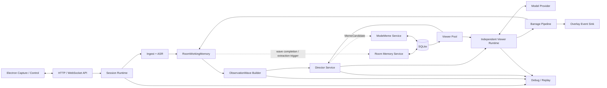
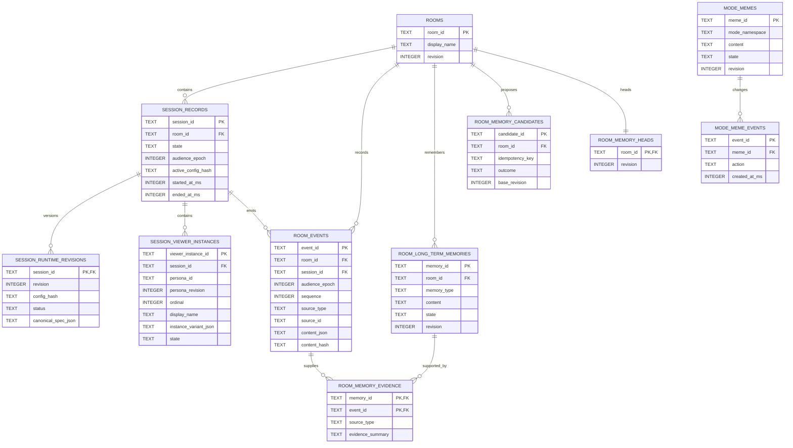

# 后端详细设计

> 状态：Architecture Baseline
>
> 更新日期：2026-07-24
>
> 本文细化 FastAPI 本地后端的模块、依赖、运行时数据流和 SQLite 持久化设计。AI 观众发言行为以 [AUDIENCE_SPEAKING_PRODUCT_SPEC.md](./AUDIENCE_SPEAKING_PRODUCT_SPEC.md) 为准；本文中的 Director 描述均已废弃。

## 1. 设计结论

第一版后端采用以下基线：

- 一个由 Electron Main 管理的 FastAPI 本地进程。
- 同一时刻只维护一个活动直播会话。
- 音频、画面、`ObservationWave`、Provider 请求和待显示弹幕位于有界内存管线中。
- Room、最小会话记录、runtime revisions、Viewer 池结构、有界公开结构事件、Room 长期记忆、证据和 ModeMeme 使用 SQLite 持久化。
- `32` 是同时 active ViewerInstance 上限；单个 Session 内创建过的唯一 Viewer 另有有界上限。一个 PersonaTemplate 可以赋予多个独立 ViewerInstance。
- Director 每波调用一次并只产出 SceneAssessment；每个 Viewer 本地独立判断是否发言，最终候选各使用一个独立 Provider 请求，首版不做多 Viewer batching。
- Room 是共享大脑边界；不存在按 Persona 或 Viewer 隔离的私有长期事实库。
- Pydantic/JSON Schema 是跨进程合同单一来源，并生成 TypeScript；Debug API、headless harness 和 replay 是首版后端能力。
- HTTP 和 WebSocket 处理协议，Application Service 负责用例，Domain 负责不变量，Provider 和 Infrastructure 负责外部适配。
- 业务层只依赖 Port，不直接依赖 SQLite、StepFun 或 OpenAI-compatible 协议。

第一版不引入微服务、Redis、消息中间件、远程数据库、完整事件溯源或独立向量数据库。以后增加云同步、直播历史或多用户能力时，需要重新评估这些边界，不能在当前本地应用中预埋分布式复杂度。

## 2. 依赖方向

模块依赖遵循以下方向：

```text
api -> application -> domain
                \--> application ports

providers -------> application ports
infrastructure ---> application ports

bootstrap 负责创建具体实现并注入 application
```

约束如下：

- `api` 不包含调度、记忆、去重或会话状态转换逻辑。
- `application` 可以协调领域对象和 Port，但不能导入 FastAPI、SQLAlchemy、StepFun 或 OpenAI-compatible wire format。
- `domain` 不导入 FastAPI、SQLAlchemy、HTTP 客户端或桌面端代码。
- `contracts` 只定义跨进程 HTTP/WebSocket DTO 和生成 TypeScript 所需的 Pydantic Schema，不作为数据库模型。
- `providers` 和 `infrastructure` 是 Adapter，可以依赖 Domain 和 Port；反向依赖不允许。
- SQLAlchemy 模型只存在于 SQLite Adapter 内，不能从 Repository 泄漏到业务层。

当前代码可以渐进迁移到以下目标结构，不需要为了目录外观一次性移动所有骨架文件：

```text
src/advx_backend/
  api/
    http/
    ws/
  application/
    ports/
    session_service.py
    ingest_service.py
    room_service.py
    observation_wave_builder.py
    runtime_config_service.py
    viewer_pool_service.py
    viewer_audience_service.py
    viewer_behavior_service.py
    director_service.py
    viewer_runtime.py
    barrage_pipeline.py
    memory_service.py
    meme_service.py
    debug_service.py
    replay_service.py
  contracts/
  domain/
    session.py
    room.py
    persona.py
    viewer.py
    observation_wave.py
    crowd_decision.py
    barrage.py
    memory.py
    meme.py
  providers/
    asr/
    model/
  infrastructure/
    persistence/sqlite/
    logging/
    security/
  bootstrap.py
  main.py
```

Repository、ASR、Model Provider、时钟、ID 生成器和实时事件输出接口放在 `application/ports/`。具体的 SQLite Repository、StepFun ASR 和 OpenAI-compatible Model Provider 分别实现这些接口。

## 3. 应用模块

| 模块 | 责任 | 不负责 |
| --- | --- | --- |
| API / Protocol | 本地鉴权、版本协商、消息大小和 Pydantic 校验、命令分发、错误映射 | 业务状态、模型调用、数据库查询策略 |
| Session Service | 状态机、活动会话标识、`audience_epoch`、任务作用域、暂停、恢复、停止、取消和状态快照 | 媒体采集和 Provider wire format |
| Ingest Service | 接收有界音频、画面和用户文字，校验会话与顺序，将输入交给 ASR 或 Room | 长期存储媒体、构建 Prompt |
| Room Service | 为公开互动分配有序事件，维护 `RoomWorkingMemory`，异步保存有界可恢复结构事件 | 保存原始媒体或无界直播历史 |
| Observation Wave Builder | 合并相近触发，选择历史帧与事件，构造冻结 `ObservationWave`，淘汰过期上下文 | 选择 Viewer 或解释模型输出 |
| Runtime Config Service | 校验 canonical runtime spec、hash、base revision 和 capability，在波边界原子应用或回滚 | 编辑 Electron 工作区或保存凭据 |
| Viewer Pool / Audience Service | 创建独立 ViewerIdentity，维护 join/leave/rejoin、目标在线人数、限时禁言、踢出和热更新 | 把 PersonaTemplate 当作观众身份 |
| Viewer Behavior Service | 按 Viewer 计算 eligibility、发言概率和稳定抽样，准确点名时执行本地保底 | 调用模型或直接发布弹幕 |
| Director Service | 计算本地硬预算、调用一次 Director、校验 `SceneAssessment` 和 `MemeCandidate` | 选择准确 Viewer ID 或生成弹幕正文 |
| Viewer Runtime | 为每个选中 Viewer 建立独立请求，执行并发、latest-wins、重试和提交围栏 | 多 Viewer batching 或绕过本地预算 |
| Barrage Pipeline | 校验结构、身份、epoch、sequence、TTL、evidence、长度、屏蔽词、重复和密度，产生可信 `BarrageEvent` | 接受模型创建的新身份或直接修改记忆 |
| Memory Service | 检索 Room memory slice，异步处理候选、证据、合并、冲突、编辑、撤销和删除 | 保存原始音频、画面、完整 Prompt 或私有 Viewer 长期库 |
| Meme Service | 校验、自动入库、撤销、编辑、归档和恢复 mode-scoped `ModeMeme` | 把 `MemeCandidate` 直接变成弹幕 |
| Debug / Replay | 提供机器可读 runtime context、trace、recorded replay 和显式 live replay | 暴露凭据、原始媒体、完整 Provider 响应或思维链 |
| Persistence | Repository、事务、迁移、SQLite 配置和领域对象映射 | 实时调度与业务策略 |
| Observability | 脱敏日志、运行状态和耗时指标 | 记录凭据、媒体正文或完整 Provider 响应 |

触发阈值、响应预算、发言概率、记忆检索排序和并发参数属于可调策略，但核心拓扑不是开放项：一波一次 Director 场景评估、每 Viewer 本地独立决策、最终候选每实例一个独立请求、同波冻结上下文、Room 共享长期记忆。策略不能固化到 WebSocket Handler 或 Model Adapter 中。

## 4. 实时处理流程



一次正常生成遵循以下顺序：

1. API 校验本地凭证、协议版本、消息类型、大小和 `session_id`。
2. Ingest Service 接收输入；用户文字直接成为公开 Room Event，音频交给 ASR，画面进入有界帧缓冲。
3. ASR 只有带稳定 utterance ID 的最终转写能够幂等成为 `user_voice` Room Event；部分转写只用于状态展示和调试。
4. Observation Wave Builder 合并相近的文字、最终语音和显著画面变化，冻结 public context、FrameBundle、Room memory revision 和 deadline。
5. 本地预算器根据 ModeDefinition、事件类型、冷却和 Provider 压力计算本波硬上限。
6. Director Service 每波调用一次，返回不绑定具体 Viewer 的 `SceneAssessment` 和可选 `MemeCandidate`。
7. Viewer Behavior Service 逐个过滤 inactive/muted/cooldown Viewer，计算确定性 desire 并在硬预算内选出最终候选；准确点名 Viewer 保底。
8. Viewer Runtime 为每个最终候选创建一个独立请求，并注入同波共享上下文、Room memory slice 和该实例的 `ViewerPrivateState`。
9. Viewer 请求在有界并发和 latest-wins 邮箱中运行；合法结果按完成顺序进入 Barrage Pipeline，不等待其他 Viewer。
10. Barrage Pipeline 在发布前重新检查 Session、epoch、Viewer、sequence、presence/moderation/behavior revisions、deadline、取消状态、evidence、target、内容和去重。
11. 通过检查的弹幕发送给 Electron，并写入 `RoomWorkingMemory`；同波其他 Viewer 不可见，从下一波起共享。
12. 波次完成后，Memory Service 可以低优先级异步提取 Room memory candidate；发布弹幕不等待该任务。
13. Meme Service 独立校验 Director 的候选，按设置自动入库并发出可撤销通知；候选本身不能成为弹幕。
14. Debug / Replay 为每一步记录结构化引用、hash、版本、时序、状态和副作用结果，不记录敏感正文或隐藏推理。
15. 停止、热更新、后端恢复、epoch/sequence 失效或 TTL 到期后，旧任务即使返回也不得进入 Room、Overlay、记忆或梗库。

每个异步工作项都必须携带 `room_id`、`session_id`、`audience_epoch`、创建时间和 deadline，以及适用时的 `observation_id`、`generation_request_id`、`viewer_instance_id` 和 `viewer_sequence`。Session Service 为活动会话持有统一任务作用域；停止时先让 Session 不再接受结果，再取消任务并清空有界队列。

## 5. 数据生命周期

| 数据类别 | 存储位置 | 生命周期 |
| --- | --- | --- |
| 音频块、画面帧 | 后端有界内存 | 被消费、覆盖、暂停或停止后释放 |
| ASR 部分结果 | 后端有界内存 | 最终结果到达、失败或停止后释放 |
| 完整 `RoomWorkingMemory`、`ObservationWave` | 当前会话有界内存 | 窗口过期、覆盖或停止后释放 |
| 可恢复公开结构事件 | SQLite `room_events` | 按每 Room/Session 有界保留策略裁剪 |
| Generation Request、Provider 原始响应 | 单次任务内存 | 完成、取消、超时或失败后释放 |
| 待显示弹幕 | 有界输出队列 | 显示、清屏、过期或停止后释放 |
| PersonaTemplate、ModeDefinition、Provider 非敏感设置 | Electron 管理的版本化工作区 | 用户修改或清除配置前保留 |
| Runtime revision、Viewer 池结构、最小会话记录 | SQLite | 用于热更新、幂等和恢复，不复制原始媒体 |
| Room 长期记忆、候选、证据和 revision head | SQLite | 用户编辑、撤销、删除或清除 Room 数据前保留 |
| ModeMeme 和 ModeMeme 事件 | SQLite | 按 mode namespace 保存，可撤销和归档 |
| ViewerPrivateState | 后端有界内存并随同一未终止 Session 的 Viewer 持久化 | 正常 Session 结束时清空；崩溃恢复同一 Session 时恢复 |
| API Key、访问令牌 | Electron `safeStorage` | 用户替换或删除前保留；后端只持有会话内明文 |
| 结构化日志和 Debug Trace | 本地有界文件/事件流 | 按保留策略轮换，不包含凭据、原始媒体、完整 Prompt/响应或思维链 |

第一版明确不向 SQLite 写入：

- 原始麦克风音频。
- 连续画面或代表帧二进制数据。
- 无界 Room Event 历史。
- 原始或无界完整语音历史。
- 完整 Prompt、Provider 请求或 Provider 原始响应。
- 隐藏推理或 chain-of-thought。
- API Key、访问令牌或短期本地连接凭证。

`room_events` 只保存恢复所需的有界公开结构事件和内容 hash/有限正文，不保存原始媒体。长期记忆通过事件 ID 和有限证据摘要关联。recorded replay 只读取显式制作、脱敏并版本化的 fixture；live replay 必须显式开启，且会产生真实 Provider 调用和费用。

## 6. SQLite 基线

SQLite 数据库由 FastAPI 后端单独拥有。Electron 负责确定 `userData` 下的数据目录并在启动时传给后端，但 Electron 不直接打开或修改数据库文件。

实现基线如下：

- 使用 SQLAlchemy 映射持久化模型，使用 `aiosqlite` 连接 SQLite，使用 Alembic 管理迁移。
- 开启 `foreign_keys=ON`、WAL 和有界 `busy_timeout`。
- 所有写操作使用短事务；音频、画面和弹幕实时发布不等待数据库事务，结构事件通过有界异步写入持久化。
- ID 使用全局唯一的不透明文本值，时间统一使用 UTC Unix 毫秒整数。
- canonical runtime spec、Viewer 微变体和开放元数据可以使用 JSON 文本，但必须在写入前由版本化 Pydantic 模型校验。
- 身份、外键、状态、epoch、revision、sequence、hash、时间和可检索关系使用普通列，不埋入 JSON。
- 用户可编辑对象和后台候选使用递增 `revision` 或 compare-and-swap，避免热更新、记忆任务和用户编辑互相覆盖。

数据库初始目标位置为 Electron `userData/data/advx.sqlite3`。实际路径由启动配置提供，领域层不得依赖平台路径。

## 7. 数据模型

下图展示关系和关键字段；各表的完整业务字段与约束在后续小节中定义。



### 7.1 `rooms` 与 `session_records`

`rooms` 是共享大脑的持久 namespace。首版 UI 只使用一个默认 Room，但所有记忆、事件和 Session 从首版就携带稳定 `room_id`，测试和 headless 运行必须使用隔离 Room。

`session_records` 保存稳定 `session_id`、`room_id`、状态、当前 `audience_epoch`、session seed、目标在线人数、下一个 creation ordinal、population revision、活动 config hash、启动/结束时间和恢复信息。相同 `client_request_id` 与相同 canonical hash 必须幂等返回同一 Session；相同 request ID 配不同 hash 返回 409。开始会话使用 `starting -> running` 两阶段提交。

### 7.2 `session_runtime_revisions`

每次启动、热更新和回滚都保存完整 canonical runtime spec，而不是无法独立恢复的局部 patch。

| 字段 | 规则 |
| --- | --- |
| `session_id`、`revision` | 复合主键；revision 单调递增 |
| `apply_id` | 客户端幂等键，同一 Session 内唯一 |
| `base_revision` | compare-and-swap 的旧 revision |
| `config_hash` | 后端对规范化内容重算的 hash |
| `status` | `pending`、`committed`、`rejected` 或 `rolled_back` |
| `canonical_spec_json` | 通过版本化 Pydantic Schema 校验的完整快照，不含凭据 |
| `diff_summary_json` | 机器可读的 Viewer/Provider/Mode 变更摘要 |
| `created_at_ms`、`updated_at_ms` | UTC Unix 毫秒 |

热更新先持久化 `pending`，只在 `ObservationWave` 边界原子切换内存指针、递增 `audience_epoch` 并提交 revision。校验或 capability probe 失败时旧 revision 继续服务。

### 7.3 `session_viewer_instances`

保存当前逻辑 Session 的 Viewer 结构：独立身份、Persona assignment、creation ordinal、微变体、presence/moderation/behavior revisions、禁言/踢出状态、sequence 和可恢复的私有行为状态。它不保存私有长期事实。

Viewer ID 在同一 Session 内不复用。热更新和 Mode 切换保留 ViewerIdentity；Persona/override 变化的存量实例保留 ID 并按规则重置行为状态；超出新目标的 active Viewer 才移除；新增实例使用单调 creation ordinal。Viewer 主动离开可同场重返，被踢后不可重返。正常停止将全部 Viewer 标记 ended 并清空私有状态；异常重启恢复同一逻辑 Session 的 Viewer 和行为状态。

### 7.4 `room_events`

`room_events` 保存恢复需要的有界公开结构事件，包括稳定事件 ID、顺序、来源、Session、epoch、有限结构内容、内容 hash 和发生时间。它不保存原始音频、完整截图、完整 Prompt 或 Provider 原始响应。

保留策略必须同时限制事件数量、时间窗和文本大小。`RoomWorkingMemory` 仍以内存环形缓冲为权威热路径；持久事件用于恢复同一逻辑 Session 和解释长期记忆证据，不提供完整直播回放。

### 7.5 Room 长期记忆

`room_long_term_memories` 按 `room_id` 保存所有 Viewer 共享的长期记忆。每条记录包含类型、内容、标签、重要度、置信度、状态、revision、撤销/替代关系和时间。不存在 `viewer_instance_id` 或 `persona_id` 所有权列。

`room_memory_evidence` 将记忆关联到一个或多个公开结构事件，并保存来源类型和有限证据摘要。用户偏好或现实事实必须至少有用户文字、最终语音、可信画面事件或系统事件证据；只有 AI 输出的候选最多保存为 `room_lore`，不能证明现实事实。

`room_memory_candidates` 保存幂等键、base revision、候选类型、证据引用和本地决策结果。`room_memory_heads` 为每个 Room 保存当前 collection revision。候选、证据、memory 变更、candidate outcome 和 head 前进必须在同一事务中 compare-and-swap 提交。

### 7.6 ModeMeme

`mode_memes` 按稳定 mode namespace 保存梗内容、强度、状态、来源和 revision。`mode_meme_events` 保存入库、撤销、编辑、归档和恢复事件。Director 的 `MemeCandidate` 只有经过本地校验后才能入库；候选和 meme 记录都不能直接进入 Barrage Pipeline。

## 8. 索引与约束

第一版至少需要以下索引：

- `session_records(room_id, state, ended_at_ms)`。
- `session_runtime_revisions(session_id, revision)` 唯一。
- `session_runtime_revisions(session_id, apply_id)` 唯一。
- `session_runtime_revisions(session_id, config_hash)`。
- `session_viewer_instances(session_id, state, viewer_instance_id)`。
- `session_viewer_instances(session_id, persona_id, ordinal)`。
- `room_events(room_id, session_id, sequence)` 唯一。
- `room_events(room_id, occurred_at_ms)`。
- `room_long_term_memories(room_id, state, updated_at_ms)`。
- `room_long_term_memories(room_id, state, importance, last_recalled_at_ms)`。
- `room_memory_evidence(event_id, memory_id)`。
- `room_memory_candidates(room_id, idempotency_key)` 唯一。
- `mode_memes(mode_namespace, state, updated_at_ms)`。

所有关系使用外键约束。删除 Room 数据时应按显式清除流程级联其记忆、候选、证据和事件；删除记忆应级联证据。Session 或 Viewer 生命周期结束不能删除 Room 长期记忆。Viewer ID 在同一 Session 内不可复用，`display_name` 不建立唯一约束。JSON 字段即使 SQLite 支持 JSON 函数，也不能替代应用层 Pydantic 校验。

## 9. Repository 与事务

Application 层依赖以下概念 Port：

| Port | 主要操作 |
| --- | --- |
| `RoomRepository` | 获取或创建 Room、读取 revision 和执行显式清除 |
| `SessionRuntimeRepository` | 幂等开始、保存/提交 runtime revision、epoch 前进、恢复和结束 |
| `ViewerInstanceRepository` | 保存 Viewer 池结构和生命周期，不保存私有长期记忆 |
| `RoomEventRepository` | 异步追加、按界限裁剪和读取恢复所需公开结构事件 |
| `RoomMemoryRepository` | 按 Room 检索、创建、合并、替代、撤销和删除记忆 |
| `ModeMemeRepository` | 按 mode namespace 读取和提交 meme 及其事件 |
| `UnitOfWork` | 控制跨 Repository 的事务提交和回滚 |

事务边界如下：

- Session start 的幂等键、初始 runtime revision、Viewer 池和 `starting -> running` 状态在受控事务中提交。
- 热更新的 pending revision 先持久化；波边界切换时 revision、config hash、epoch 和 Viewer 生命周期变化一致提交。
- 记忆候选幂等记录、全部来源证据、memory 变更、candidate outcome 和 Room memory head 前进在同一事务中完成。
- 合并记忆时，新内容、来源更新和旧记忆的 `superseded` 状态在同一事务中完成。
- ModeMeme 状态和对应 event 在同一事务中完成，撤销必须产生反向事件。
- 用户编辑使用 `WHERE revision = expected_revision`；冲突时返回明确错误，不做最后写入者静默覆盖。
- 用户编辑、撤销或删除提交成功后，Memory Service 先发布新 memory head，再允许后续 ObservationWave 读取；已经冻结的波不被中途修改。

Repository 返回 Domain 对象或 Application DTO，不返回 SQLAlchemy Session 和 ORM Entity。WebSocket Handler 不直接调用 Repository；它将命令交给对应 Application Service。

## 10. 记忆检索与写入

首版不使用向量数据库。检索过程先限定 `room_id`、`state=active` 和未过期记录，再根据本波事件、标签、重要度、更新时间和最近召回时间选择有界结果。所有选中 Viewer 至少收到相同核心 memory slice；Persona 只能影响额外关注排序，不能形成私有不可见长期库。候选数量和权重属于运行参数，通过实测调整。

记忆写入遵循“模型提议，本地决定”：

1. 波次完成后，低优先级提取策略按需产生结构化 `RoomMemoryCandidate`，包含 `room_id`、候选类型、内容和来源事件 ID；弹幕发布不等待该任务。
2. Memory Service 确认 Session/epoch 仍有效、来源属于同一 Room 且事件存在于当前缓冲或有界持久事件中。
3. 本地策略检查证据类型、内容长度、敏感信息、重复、冲突和是否值得长期保存。
4. 用户偏好和现实事实要求非 AI 证据；只有 AI 互动的候选只能归类为 `room_lore`。
5. Memory Service 决定创建、合并、替代、撤销或拒绝，并使用 idempotency key 和 base revision 原子提交。
6. 提交后推进 Room memory head；下一波读取新 revision，已经冻结的波继续使用旧 revision。

失败、取消、过期、stale、旧 epoch 或被拒绝的 Viewer 输出不能进入候选提取。未来需要语义检索时，在 `RoomMemoryRetriever` Port 后增加 embedding Adapter 和独立表，不修改共享所有权规则。

## 11. 迁移、备份与恢复

- 后端在对外报告可开始会话前执行 Alembic 迁移。
- 迁移失败时不得使用半迁移数据库启动直播；健康状态应暴露持久化错误，Electron 仍保留退出和恢复入口。
- 破坏性迁移前使用 SQLite Backup API 创建一致性备份，不能在数据库打开时直接复制主文件和 WAL 文件。
- 自动迁移备份需要有限数量和保留周期，并与“清除全部本地数据”一起删除。
- 数据库文件和备份使用仅当前操作系统用户可访问的文件权限。
- 后端启动时检查未结束 Session 的 committed runtime revision、Viewer 池和有界 Room events。校验通过时恢复相同逻辑 `session_id`、递增 `audience_epoch`、重建 `RoomWorkingMemory` 和 Viewer 短期状态，并清除旧队列和网络任务。
- 不恢复原始音频、完整帧、旧 Provider 请求、旧 deadline 或旧 epoch 候选。
- runtime snapshot 或事件链校验失败时 fail closed，报告机器可读恢复错误，不能静默创建看似连续的新状态。

第一版承诺同一逻辑 Session 的后端进程恢复，但不承诺媒体无缝续传或完整直播历史回放。Electron 必须展示 `recovered` 状态并重新建立数据面。备份只用于迁移失败恢复，不能被正常业务查询当作已删除记忆的旁路数据源。

## 12. 故障降级

- 数据库在会话开始前不可用时，后端不能建立可恢复 runtime，应阻止开始并报告明确错误。
- 数据库在会话中途不可用时，可以使用已经加载的 committed runtime revision、Viewer 池和 Room memory slice 继续当前波，但停止热更新、恢复点、Room 长期记忆和 ModeMeme 写入，并向 Electron 报告降级状态。
- 弹幕已经通过管线并显示后，独立的记忆写入失败不能撤回弹幕，也不能假装记忆已保存。
- Director strict 模式失败时保持安静并报告错误；resilient 模式只允许使用确定性本地 fallback，并标记 `decision_source=fallback`，不得复用旧决定。
- 单个 Viewer 失败不阻塞其他 Viewer；只有瞬时网络错误、429 或 5xx 且 TTL 足够时重试同一 Viewer 一次，不允许替换 Viewer 补位。
- Provider、ASR 或数据库错误不得阻止 Session Service 执行停止和清理。
- 日志和 Debug Trace 可以记录 ID、revision、hash、事件/帧引用、时序、状态、重试、stale reason 和副作用结果，不记录凭据、原始音频、完整私密截图、完整 Prompt/Provider 响应或思维链。

### 12.1 AI 调用回路日志

Director、Viewer、视觉摘要、记忆提取和 ASR 的每次外部调用都写入同一套有界
`AiCallTrace`。一次重试是新的 `call_id`，但沿用原业务 `correlation_id`；
Viewer 使用 `generation_request_id`，Director 和视觉摘要使用 `observation_id`，ASR
使用与 final transcript 一致的 `utterance_id`。时间线至少区分准备、发送、收到响应、
流式接收、解析完成、失败、阻止、取消和后端重启中断。

`AiCallTrace` 保存模型、端点、HTTP 状态、Provider request ID、Token、字节数、hash、
耗时、错误类型、可重试性、关联 ID、脱敏后的输入摘要和严格解析后的业务输出。图片和
音频正文只保留大小与 hash；输入中的 Room memory 只保留 revision/ID；记忆提取结果
只保留候选数量、类型、证据 ID、评分和正文 hash。System instruction 只记录长度与
hash；Viewer private state 只保留 revision、事件引用和状态 hash。凭据、完整 Prompt、
Provider 原始响应和隐藏推理始终不进入日志。日志以有界 JSONL 保存在本地
`debug/ai-calls.jsonl`，通过 `GET /debug/ai-calls` 查询；Electron 的“AI 调用”页只消费
该接口，不维护第二份调用状态。

## 13. 测试要求

- Domain 单元测试覆盖 Session/epoch 转换、精确人格人数的 Viewer 池分配、稳定别名/微变体、ObservationWave 冻结、TTL、latest-wins、去重和记忆状态转换。
- Application 测试使用内存 Fake Port，覆盖暂停、停止、热更新、回滚、模式切换、旧结果零副作用、同波冻结、Room 共享记忆和写入失败降级。
- 所有 SQLite Repository 运行同一组 Repository 合同测试。
- 迁移测试至少覆盖空数据库、上一版本数据库、失败回滚和备份恢复。
- 持久化测试覆盖外键、裁剪、revision/hash 冲突、配置原子切换、Room memory 候选幂等提交、证据约束、ModeMeme 撤销和 Viewer ID 不复用。
- 隐私测试确认数据库、日志、trace 和 replay bundle 中不存在原始音频、完整私密截图、凭据、完整 Prompt、Provider 原始响应和思维链。
- Headless harness 测试覆盖 JSON stdin/stdout、稳定退出码、固定 seed、虚拟时钟以及隔离 data dir、SQLite、端口、token 和 room。
- recorded replay 测试不得调用 Provider；live replay 只有显式开启才允许调用并产生费用。
- 集成测试覆盖后端重启后恢复相同逻辑 Session、epoch 递增、旧任务失效和 `RoomWorkingMemory` 有界重建。
- CS2/CSGO E2E fixture 覆盖普通沉默、高光、点名、文字回应、6657 指定人格人数更新、共享记忆、成长梗和失败路径；真实输出按结构、身份、证据、类别和状态变化验收，不比较固定文案。

## 14. 保留的开放问题

以下算法仍未固定，但不会改变本文的模块和存储边界：

- 画面变化阈值、ambient 间隔和相近事件合并窗口。
- 普通/高光响应预算、并发、队列容量、TTL、超时和退避的最终调优值。
- Room 长期记忆的提取、合并、冲突、遗忘、相关性排序和默认阈值。
- 历史画面张数、时间窗、采样策略、尺寸和质量的最终默认值。
- 音频分段参数，以及语音 mention resolver 的置信阈值。
- 是否在未来提供显式、可配置的直播历史或回放功能。

这些问题验证后记录到 [DECISIONS.md](./DECISIONS.md)。
