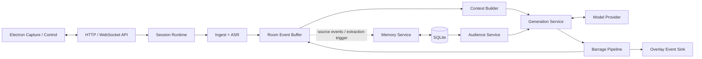
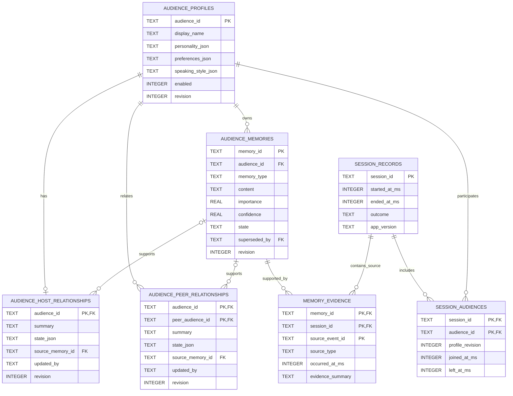

# 后端详细设计

> 状态：Architecture Baseline
>
> 更新日期：2026-07-23
>
> 本文细化 FastAPI 本地后端的模块、依赖、运行时数据流和 SQLite 持久化设计。产品行为以 [PRODUCT.md](./PRODUCT.md) 为准，跨运行时边界以 [ARCHITECTURE.md](./ARCHITECTURE.md) 为准，架构决定以 [DECISIONS.md](./DECISIONS.md) 为准。

## 1. 设计结论

第一版后端采用以下基线：

- 一个由 Electron Main 管理的 FastAPI 本地进程。
- 同一时刻只维护一个活动直播会话。
- 音频、画面、近期房间事件、观察、模型请求和待显示弹幕位于有界内存管线中。
- 观众档案、关系、长期记忆、记忆来源和最小会话记录使用 SQLite 持久化。
- HTTP 和 WebSocket 处理协议，Application Service 负责用例，Domain 负责不变量，Provider 和 Infrastructure 负责外部适配。
- 业务层只依赖 Port，不直接依赖 SQLite、StepFun 或 OpenAI-compatible 协议。

第一版不引入微服务、Redis、消息中间件、远程数据库、完整事件溯源或独立向量数据库。以后增加云同步、直播历史或多用户能力时，需要重新评估这些边界，不能在当前本地应用中预埋分布式复杂度。

## 2. 依赖方向

模块依赖遵循以下方向：

```text
api -> application -> domain
                \--> application ports

providers -------> application ports
infrastructure ---> application ports

bootstrap 负责创建具体实现并注入 application
```

约束如下：

- `api` 不包含调度、记忆、去重或会话状态转换逻辑。
- `application` 可以协调领域对象和 Port，但不能导入 FastAPI、SQLAlchemy、StepFun 或 OpenAI-compatible wire format。
- `domain` 不导入 FastAPI、SQLAlchemy、HTTP 客户端或桌面端代码。
- `contracts` 只定义跨进程 HTTP/WebSocket DTO 和生成 TypeScript 所需的 Pydantic Schema，不作为数据库模型。
- `providers` 和 `infrastructure` 是 Adapter，可以依赖 Domain 和 Port；反向依赖不允许。
- SQLAlchemy 模型只存在于 SQLite Adapter 内，不能从 Repository 泄漏到业务层。

当前代码可以渐进迁移到以下目标结构，不需要为了目录外观一次性移动所有骨架文件：

```text
src/advx_backend/
  api/
    http/
    ws/
  application/
    ports/
    session_service.py
    ingest_service.py
    room_service.py
    context_builder.py
    audience_service.py
    generation_service.py
    barrage_pipeline.py
    memory_service.py
  contracts/
  domain/
    session.py
    audience.py
    room.py
    observation.py
    barrage.py
  providers/
    asr/
    model/
  infrastructure/
    persistence/sqlite/
    logging/
    security/
  bootstrap.py
  main.py
```

Repository、ASR、Model Provider、时钟、ID 生成器和实时事件输出接口放在 `application/ports/`。具体的 SQLite Repository、StepFun ASR 和 OpenAI-compatible Model Provider 分别实现这些接口。

## 3. 应用模块

| 模块 | 责任 | 不负责 |
| --- | --- | --- |
| API / Protocol | 本地鉴权、版本协商、消息大小和 Pydantic 校验、命令分发、错误映射 | 业务状态、模型调用、数据库查询策略 |
| Session Service | 状态机、活动会话标识、任务作用域、暂停、恢复、停止、取消和状态快照 | 媒体采集和 Provider wire format |
| Ingest Service | 接收有界音频、画面和用户文字，校验会话与顺序，将输入交给 ASR 或 Room | 长期存储媒体、构建 Prompt |
| Room Service | 为公开互动分配有序事件，维护当前会话的 `RoomEvent` 环形缓冲 | 保存完整直播历史 |
| Context Builder | 选择近期代表帧与事件，构造不可变 `Observation`，淘汰过期上下文 | 选择观众或解释模型输出 |
| Audience Service | 读取观众档案、关系、长期记忆和会话内状态，创建本轮观众快照 | 决定 Provider 协议和直接写入模型建议 |
| Generation Service | 判断触发、选择候选观众、组装 `GenerationRequest`、调用 Model Port、检查请求归属 | 内容过滤和数据库模型 |
| Barrage Pipeline | 校验结构、身份、会话、观察、TTL、长度、屏蔽词、重复和密度，产生可信 `BarrageEvent` | 接受模型创建的新身份或直接修改记忆 |
| Memory Service | 处理记忆与关系变更候选，校验来源，执行合并、冲突处理、编辑、删除和检索 | 保存原始音频、画面或完整 Prompt |
| Persistence | Repository、事务、迁移、SQLite 配置和领域对象映射 | 实时调度与业务策略 |
| Observability | 脱敏日志、运行状态和耗时指标 | 记录凭据、媒体正文或完整 Provider 响应 |

观众发言触发、参与选择、批量或独立模型调用仍属于可替换策略。Generation Service 应通过策略接口使用这些算法，不能把某个实验方案固化到 WebSocket Handler 或 Model Adapter 中。

## 4. 实时处理流程



一次正常生成遵循以下顺序：

1. API 校验本地凭证、协议版本、消息类型、大小和 `session_id`。
2. Ingest Service 接收输入；用户文字直接成为公开 Room Event，音频交给 ASR，画面进入有界帧缓冲。
3. ASR 只有最终转写能够成为 `user_voice` Room Event；部分转写只用于状态展示。
4. Context Builder 从当前会话的缓冲中创建带 `observation_id` 的不可变观察。
5. Generation Service 选择候选观众，并从 Audience Service 获取各自隔离的档案、关系和记忆快照。
6. Model Provider 返回零条或多条候选，每条候选必须引用本轮已有的 `audience_id`。
7. Barrage Pipeline 丢弃身份、会话、观察、时效或内容检查失败的候选。
8. 通过检查的弹幕发送给 Electron，同时写入当前会话的 Room Event 缓冲。
9. 需要形成长期状态时，模型只能产生候选；Memory Service 独立校验来源并提交数据库事务。
10. 停止、会话替换或 TTL 到期后，旧任务即使返回也不得进入 Room 或 Overlay。

每个异步工作项都必须携带 `session_id`、创建时间，以及适用时的 `observation_id` 和 `request_id`。Session Service 为活动会话持有统一的任务作用域；停止时先让会话 ID 失效，再取消任务并清空有界队列。

## 5. 数据生命周期

| 数据类别 | 存储位置 | 生命周期 |
| --- | --- | --- |
| 音频块、画面帧 | 后端有界内存 | 被消费、覆盖、暂停或停止后释放 |
| ASR 部分结果 | 后端有界内存 | 最终结果到达、失败或停止后释放 |
| Room Event、Observation | 当前会话环形缓冲 | 过期、覆盖或停止后释放 |
| Generation Request、Provider 原始响应 | 单次任务内存 | 完成、取消、超时或失败后释放 |
| 待显示弹幕 | 有界输出队列 | 显示、清屏、过期或停止后释放 |
| 观众档案、关系、长期记忆、来源摘要 | SQLite | 用户修改、删除或清除本地数据前保留 |
| 最小会话记录和会话观众关联 | SQLite | 用于来源关联和崩溃标记，不支持内容回放 |
| 普通应用与 Provider 配置 | Electron 管理的版本化配置 | 用户修改或清除配置前保留 |
| API Key、访问令牌 | Electron `safeStorage` | 用户替换或删除前保留；后端只持有会话内明文 |
| 结构化日志 | 本地日志文件 | 按保留策略轮换，不包含敏感正文 |

第一版明确不向 SQLite 写入：

- 原始麦克风音频。
- 连续画面或代表帧二进制数据。
- 完整 Room Event 历史。
- 完整语音转写历史。
- 完整 Prompt、Provider 请求或 Provider 原始响应。
- API Key、访问令牌或短期本地连接凭证。

长期记忆的来源使用事件 ID 和有限长度的证据摘要表达，不依赖持久化完整事件正文。未来如果产品增加直播历史或回放，需要新增独立的、默认关闭且有明确保留期限的数据模型，不能复用长期记忆表冒充事件存储。

## 6. SQLite 基线

SQLite 数据库由 FastAPI 后端单独拥有。Electron 负责确定 `userData` 下的数据目录并在启动时传给后端，但 Electron 不直接打开或修改数据库文件。

实现基线如下：

- 使用 SQLAlchemy 映射持久化模型，使用 `aiosqlite` 连接 SQLite，使用 Alembic 管理迁移。
- 开启 `foreign_keys=ON`、WAL 和有界 `busy_timeout`。
- 所有写操作使用短事务；音频、画面和弹幕实时热路径不访问数据库。
- ID 使用全局唯一的不透明文本值，时间统一使用 UTC Unix 毫秒整数。
- 开放的人格、偏好、说话风格和关系状态使用 JSON 文本，并在写入前由版本化 Pydantic 模型校验。
- 身份、外键、启用状态、revision、时间和可检索关系使用普通列，不埋入 JSON。
- 用户可编辑对象使用递增 `revision` 做乐观并发检查，避免后台记忆任务覆盖用户刚完成的修改。

数据库初始目标位置为 Electron `userData/data/advx.sqlite3`。实际路径由启动配置提供，领域层不得依赖平台路径。

## 7. 数据模型

下图展示关系和关键字段；各表的完整业务字段与约束在后续小节中定义。



### 7.1 `audience_profiles`

保存稳定逻辑身份及用户可编辑档案。

| 字段 | 规则 |
| --- | --- |
| `audience_id` | 主键；模型不能创建或修改 |
| `display_name` | 非空；不要求全局唯一，身份判断只能使用 ID |
| `avatar_ref` | 可空；保存相对资源引用，不保存图片 BLOB |
| `personality_json` | 核心人格，Pydantic 校验后写入 |
| `preferences_json` | 喜好、厌恶和关注主题 |
| `speaking_style_json` | 语言习惯、长度和表达倾向 |
| `enabled` | 仅允许 `0` 或 `1` |
| `origin` | `preset` 或 `custom` |
| `preset_id`、`preset_version` | 可空；记录模板来源，不用于覆盖用户修改 |
| `revision` | 从 1 递增，用于乐观并发控制 |
| `created_at_ms`、`updated_at_ms` | UTC Unix 毫秒 |

随应用分发的观众预设是只读模板。用户首次启用预设时，将其复制为数据库中的稳定档案；后续预设升级不能静默覆盖用户已经修改的档案。

### 7.2 关系表

`audience_host_relationships` 表示观众对主播的关系；每个观众最多一行。`audience_peer_relationships` 表示一个观众对另一个观众的方向性关系，复合主键为 `(audience_id, peer_audience_id)`，并禁止两者相等。

关系表包含摘要、结构化状态 JSON、`updated_by`、revision 和更新时间。模型不得直接更新关系；每次自动更新必须引用属于关系拥有者且拥有来源证据的 `source_memory_id`，用户直接编辑时 `updated_by` 记录为 `user`。删除观众时，其拥有或指向的关系行一并删除。

用户编辑、替代或删除作为关系来源的记忆时，Memory Service 必须在同一事务中用有效来源重新计算关系，或者删除并重置该关系，不能保留包含旧记忆内容的摘要。`source_memory_id` 使用 `ON DELETE SET NULL` 作为数据库安全网，但应用层不得依赖它代替关系清理。

### 7.3 `audience_memories`

保存属于单个观众的长期记忆。

| 字段 | 规则 |
| --- | --- |
| `memory_id` | 主键 |
| `audience_id` | 外键，删除观众时级联删除 |
| `memory_type` | 可演进的业务分类，不保存 Provider 专用枚举 |
| `content` | 用户可查看和编辑的必要事实或关系摘要 |
| `tags_json` | 有界标签列表，辅助首版检索 |
| `importance`、`confidence` | `0.0` 到 `1.0`；由本地策略限制 |
| `origin` | `extracted` 或 `user` |
| `state` | `active` 或 `superseded` |
| `superseded_by` | 可空的自引用；冲突合并时指向替代记忆 |
| `last_recalled_at_ms`、`expires_at_ms` | 可空；用于召回和遗忘策略 |
| `revision` | 乐观并发控制 |
| `created_at_ms`、`updated_at_ms` | UTC Unix 毫秒 |

用户删除记忆时执行物理删除，并级联删除 `memory_evidence`。被替代但需要保留来源链的记忆使用 `superseded`，不能参与后续检索。日志只记录被删除的 ID，不记录内容。

### 7.4 `memory_evidence`

一条记忆可以引用多个公开互动来源。复合主键为 `(memory_id, session_id, source_event_id)`。

`evidence_summary` 是经过本地策略限制的短摘要或摘录，不是完整转写、画面描述或 Prompt。来源事件本身只在会话内存中存在，因此本表不对 `source_event_id` 建外键；它仍需保存 `source_type` 和 `occurred_at_ms`，供用户理解记忆来源。

### 7.5 会话记录

`session_records` 只保存会话 ID、开始和结束时间、结束结果、应用版本等最小元数据。它不是直播历史表。进行中的记录 `ended_at_ms` 为空；后端下次启动时将未正常关闭的记录标记为 `interrupted`。

`session_audiences` 保存会话参与者及当时使用的档案 revision，用于解释记忆来源，不复制完整人格和记忆快照。

## 8. 索引与约束

第一版至少需要以下索引：

- `audience_profiles(enabled, updated_at_ms)`。
- `audience_memories(audience_id, state, updated_at_ms)`。
- `audience_memories(audience_id, state, importance, last_recalled_at_ms)`。
- `memory_evidence(session_id, source_event_id)`。
- `session_records(ended_at_ms)`。
- `session_audiences(audience_id, session_id)`。

所有关系使用外键约束。观众删除应级联删除其记忆、证据、关系和会话关联；记忆删除应级联删除来源，并清理依赖该记忆的关系摘要。`display_name` 不建立唯一约束。JSON 字段即使 SQLite 支持 JSON 函数，也不能替代应用层 Pydantic 校验。

## 9. Repository 与事务

Application 层依赖以下概念 Port：

| Port | 主要操作 |
| --- | --- |
| `AudienceRepository` | 获取、列出启用观众、创建、更新、删除档案 |
| `RelationshipRepository` | 获取和更新主播/观众关系 |
| `MemoryRepository` | 按观众检索、创建、合并、替代和删除记忆 |
| `SessionRecordRepository` | 记录开始、参与者、正常结束和异常中断 |
| `UnitOfWork` | 控制跨 Repository 的事务提交和回滚 |

事务边界如下：

- 创建记忆与写入全部来源证据在同一事务中完成。
- 合并记忆时，新内容、来源更新和旧记忆的 `superseded` 状态在同一事务中完成。
- 自动更新关系时，来源记忆和关系 revision 更新在同一事务中完成。
- 编辑、替代或删除关系来源记忆时，关系重算或重置与记忆变更在同一事务中完成。
- 用户编辑使用 `WHERE revision = expected_revision`；冲突时返回明确错误，不做最后写入者静默覆盖。
- 用户删除提交成功后，Memory Service 先使相关内存快照失效，再允许新的 Generation Request 创建。

Repository 返回 Domain 对象或 Application DTO，不返回 SQLAlchemy Session 和 ORM Entity。WebSocket Handler 不直接调用 Repository；它将命令交给对应 Application Service。

## 10. 记忆检索与写入

首版不使用向量数据库。检索过程先限定 `audience_id`、`state=active` 和未过期记录，再根据标签匹配、重要度、更新时间和最近召回时间选择有界结果。候选数量和权重属于运行参数，通过实测调整。

记忆写入遵循“模型提议，本地决定”：

1. 记忆提取策略产生结构化 `MemoryCandidate`，包含目标观众、候选内容和来源事件 ID；该策略可以使用 Model Port，但模型没有写库权限。
2. Memory Service 确认观众参与本次会话，且来源事件存在于当前 Room Buffer。
3. 本地策略检查内容长度、敏感信息、重复、冲突和是否值得长期保存。
4. Memory Service 决定创建、合并、替代或拒绝，并在一个事务中写入。
5. 提交后更新或失效该观众的记忆快照。

未来需要语义检索时，在 `MemoryRetriever` Port 后增加 embedding Adapter 和独立表，不修改 Audience Engine、Memory Service 或现有记忆所有权规则。

## 11. 迁移、备份与恢复

- 后端在对外报告可开始会话前执行 Alembic 迁移。
- 迁移失败时不得使用半迁移数据库启动直播；健康状态应暴露持久化错误，Electron 仍保留退出和恢复入口。
- 破坏性迁移前使用 SQLite Backup API 创建一致性备份，不能在数据库打开时直接复制主文件和 WAL 文件。
- 自动迁移备份需要有限数量和保留周期，并与“清除全部本地数据”一起删除。
- 数据库文件和备份使用仅当前操作系统用户可访问的文件权限。
- 后端启动时把未结束的 `session_records` 标记为 `interrupted`，但不恢复媒体、Room Buffer 或在途模型任务。

第一版不承诺直播中断恢复或历史回放。备份只用于迁移失败恢复，不能被正常业务查询当作已删除记忆的旁路数据源。

## 12. 故障降级

- 数据库在会话开始前不可用时，后端不能加载稳定观众身份，应阻止开始并报告明确错误。
- 数据库在会话中途不可用时，可以使用已经加载的观众快照继续当前会话，但停止关系和长期记忆写入，并向 Electron 报告降级状态。
- 弹幕已经通过管线并显示后，独立的记忆写入失败不能撤回弹幕，也不能假装记忆已保存。
- Provider、ASR 或数据库错误不得阻止 Session Service 执行停止和清理。
- 日志可以记录 `session_id`、`observation_id`、`request_id`、错误类别和耗时，不记录凭据、媒体正文、完整转写或记忆内容。

## 13. 测试要求

- Domain 单元测试覆盖会话转换、身份不变量、TTL、去重和记忆状态转换。
- Application 测试使用内存 Fake Port，覆盖暂停、停止、旧结果丢弃、观众隔离和写入失败降级。
- 所有 SQLite Repository 运行同一组 Repository 合同测试。
- 迁移测试至少覆盖空数据库、上一版本数据库、失败回滚和备份恢复。
- 持久化测试覆盖外键、级联删除、revision 冲突、记忆来源原子写入和观众间记忆隔离。
- 隐私测试确认数据库和日志中不存在音频、图像、凭据、完整 Prompt 和 Provider 原始响应。
- 集成测试覆盖未正常结束的会话在下次启动时变为 `interrupted`。

## 14. 保留的开放问题

以下算法仍未固定，但不会改变本文的模块和存储边界：

- 观众发言触发、候选选择、批量/独立调用和彼此接话。
- 长期记忆的提取、合并、冲突、遗忘和默认启用策略。
- 画面采样、音频分段、队列容量、TTL 和超时的具体参数。
- 是否在未来提供显式、可配置的直播历史或回放功能。

这些问题验证后记录到 [DECISIONS.md](./DECISIONS.md)。
